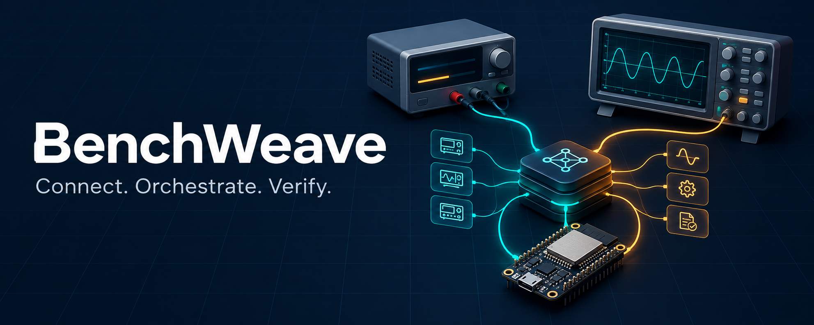

# BenchWeave

BenchWeave is a Python test-bench gateway for embedded systems, combining reusable instrument and DUT plugins, shared device profiles, and safety-aware automated testing.

**Status: architecture baseline and Python scaffold.** The repository includes versioned contracts, PoC/MVP plans and architecture validation in CI. The gateway, device plugins and hardware qualification remain to be implemented.

## The plan

- Connect instruments and devices under test through reusable plugins and typed device profiles.
- Share profiles and implementations through a central registry, with local admission and offline execution.
- Coordinate bounded test procedures with explicit ownership, measurement evidence and verified safe endings.
- Expose a consistent REST and MCP interface for applications and coding agents.

The first PoC is simulator-first. The planned hardware MVP targets the **FNIRSI DPS-150**, with **ESP32** as the provisional controller family. Unattended hardware testing requires separate bench commissioning and qualification.

## Start here

- [PoC/MVP product requirements](docs/implementation-planning/00-poc-mvp-prd.md)
- [Delivery plan](docs/implementation-planning/01-delivery-plan.md)
- [Architecture](docs/smart-test-gateway-architecture-v1.5.md)
- [Documentation index](docs/project-index.md)
- [Device developer guide — human and AI authors](docs/device-developer-guide.md)
- [AI device reviewer role and checklist](docs/ai-device-reviewer.md)
- [Development and CI](docs/development.md)
- [Architecture validation](docs/architecture-validation.md)

## Development

Use Python 3.13 and uv:

```sh
uv sync --locked --dev
uv run pytest
```

Run the architecture checks explicitly with:

```sh
uv run pytest tests/contracts -s
```

GitHub CI checks architecture contracts, rejection cases, lint, formatting, types, tests and package builds. Architectural validation does not establish runtime conformance or physical safety qualification.
