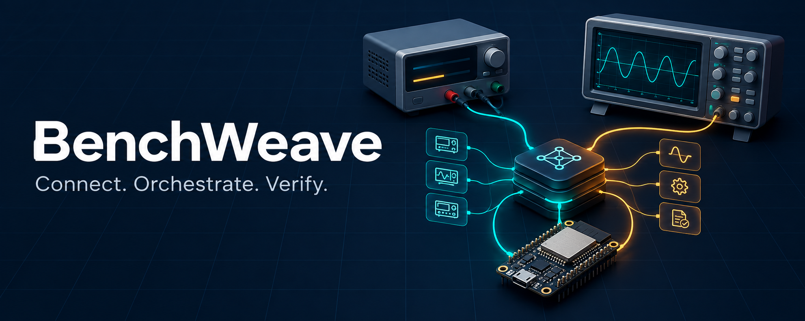

# BenchWeave

BenchWeave is a Python test-bench gateway for embedded systems, combining reusable instrument and DUT plugins, shared device profiles, and safety-aware automated testing.

**Status: architecture baseline and Python scaffold.** The repository includes versioned contracts, PoC/MVP plans and architecture validation in CI. The gateway, device plugins and hardware qualification remain to be implemented.

## The plan

- Connect instruments and devices under test through reusable plugins and typed device profiles.
- Share profiles and implementations through a central registry, with local admission and offline execution.
- Coordinate bounded test procedures with explicit ownership, measurement evidence and verified safe endings.
- Expose a consistent REST and MCP interface for applications and coding agents.

The first PoC is simulator-first. The planned hardware MVP targets the **FNIRSI DPS-150**, with **ESP32** as the provisional controller family. Unattended hardware testing requires separate bench commissioning and qualification.

## Website and documentation

The public site is at <https://www.benchweave.dev/> — the standards, the guides and architecture record, and the `benchweave` CLI reference, rendered from this repository by the docs workflow (`.github/workflows/docs.yml`, `scripts/assemble_docs_site.py`). Docs serve versioned per-tag snapshots at `docs/v/<tag>/` once a release tag exists, with the latest release at the docs root and the current tree at `docs/v/dev/`. The site's version claims are stamped at assembly from the standards manifest's active versions: claim sites in `website/index.html` carry `{{stg-*}}` tokens, and the hygiene pin refuses a three-component version literal anywhere under `website/` or in `index.qmd` (two-component prose claims remain outside the pattern by design). Preview it through `uv run python scripts/assemble_docs_site.py --dest /tmp/site-preview` — with `uv pip install "great-docs[svg]"` in the project environment first (an isolated pipx-style install silently drops the CLI reference from the build) — not by serving the raw source. The SDK has its own site at <https://sdk.benchweave.dev/>.

## Sister repository

The [plugin developer SDK](https://github.com/madeinoz67/benchweave-sdk) (`benchweave-sdk`) provides the offline SDK tooling — project generation, validation, mocks and the local UI preview. **Building a plugin? Use the standalone SDK repo — it is the canonical SDK. The `packages/sdk/` mount here is for gateway integration and can lag it.** See [Which checkout do I use?](https://github.com/madeinoz67/benchweave-sdk#which-checkout-do-i-use). The [SDK guide](docs/plugin-sdk.md) documents the SDK.

## Community

Questions, plugin builds, works in progress — join the [BenchWeave Discord](https://discord.gg/Y5XPTWQQXr). The invite is permanent. Bugs and feature requests belong in the [issue tracker](https://github.com/madeinoz67/benchweave/issues); see [SUPPORT.md](SUPPORT.md).

## Start here

- [PoC/MVP product requirements](docs/implementation-planning/00-poc-mvp-prd.md)
- [Delivery plan](docs/implementation-planning/01-delivery-plan.md)
- [Architecture](docs/smart-test-gateway-architecture-v1.5.md)
- [Documentation index](docs/project-index.md)
- [Device developer guide — human and AI authors](docs/device-developer-guide.md)
- [AI device reviewer role and checklist](docs/ai-device-reviewer.md)
- [Operator guide — running a bench: serve, report, retention, dispose, backup](docs/operator-guide.md) (`retention` is a read-only projection: it writes nothing back and never migrates the store; `dispose` is the audited disposition — delete tier always, archive tier with `--archive-target` (verified content-addressed offline copies; `--verify-archive` re-proves them), dry run by default, `--execute` to act, never migrates the store)
- [Development and CI](docs/development.md)
- [Architecture validation](docs/architecture-validation.md)

## Running as a service

`benchweave service install --data-dir <dir>` renders the systemd unit
from the store at rest (on macOS, the launchd plist analogue too). The
unit runs `serve` in the foreground under `Type=simple`, stops through the
plain `benchweave stop`, and restarts on failure (`Restart=on-failure`).
`TimeoutStopSec` is derived from the commissioned protective ceilings, so
a stop never cuts a commissioned transition short. The lifecycle verbs
keep a small file family beside the data directory: `<dir>.pid`,
`<dir>.stop`, `<dir>.log` and `<dir>.supervision.jsonl`. Every file is
mode 0600 and never secret-bearing. Logs land in `<dir>.log` under
`benchweave start`, in the journal under systemd, and on your terminal
under `serve`. The [operator guide](docs/operator-guide.md) carries the
full verb reference.

## Development

Use Python 3.13 and uv:

```sh
uv sync --locked --dev
uv run pytest
```

Run the architecture checks explicitly with:

```sh
uv run pytest tests/contracts -s
```

## UI development

The renderer lives in `packages/ui-html` (the Jinja/HTMX `benchweave-ui-html` package). See the [renderer-neutral component contract](docs/internal/ui-contract.md) (normative), the [approved UI design](docs/internal/ui-styleguide-workbench-design.md), [implementation style guide](docs/internal/ui-styleguide.md), and [portable light/dark mock-up](docs/internal/ui-styleguide-mockup.html).

The served UI (the `/ui` browser surface behind `serve`) covers the read views, leases, staged run control, and the two-phase administration flow — change submit, the independent-approval review and apply, and the failed/unknown inhibited state ([operator guide](docs/operator-guide.md)).

```sh
uv run pytest docs/internal/ui-contract.md   # the contract gate (also in the default run)
uv run pytest -m browser                     # the pattern library's axe + screenshot lane
```

The pattern library renders simulated presentation data; it does not establish runtime support or hardware qualification.

GitHub CI checks architecture contracts, rejection cases, lint, formatting, types, tests and package builds. Architectural validation does not establish runtime conformance or physical safety qualification.
