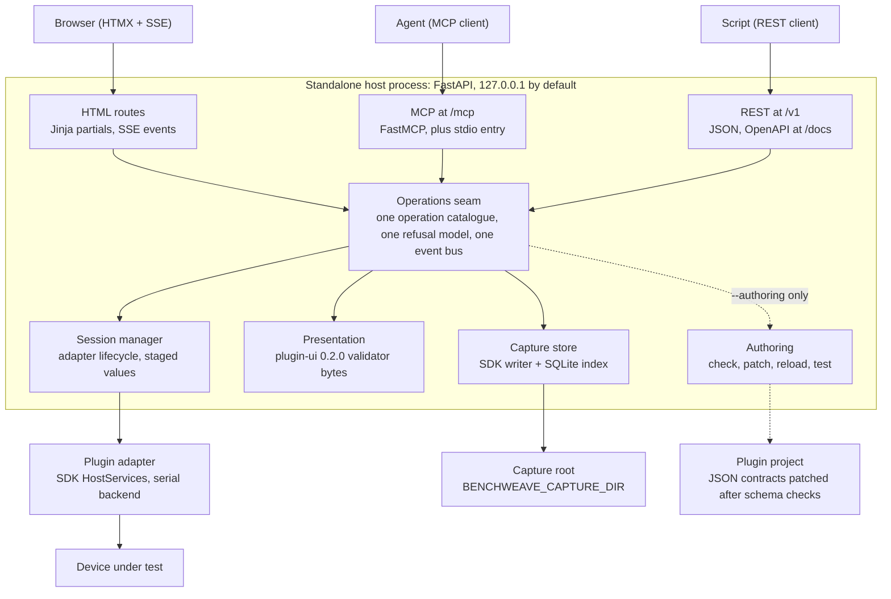

# Standalone Web UI (FastAPI + MCP + HTMX): Requirements PRD

**Status:** Draft v0.3, revised 2026-10-01 for the PRD 12 rulings; amended 2026-10-03 for the 2026-10-02 packaging rulings (issue #309: package `benchweave_sdk_server`, one `src/` tree, `benchweave-sdk[server]` extra — Summary 4, §8 Q1, NFR-P1, NFR-P2, SW-02, SW-03, §9 I1) · **Owner:** Stephen (madeinoz67) · **Scope:** `benchweave-sdk` standalone mode · **Related:** madeinoz67/benchweave#242, #243, #244

## Summary

Standalone mode needs a real operator surface: one FastAPI process that serves a server-rendered HTMX UI, a REST API and an MCP endpoint over a single operations seam, running a plugin adapter against real hardware with no gateway present. Today the SDK only offers `preview-ui` (simulated data, React renderer, stdlib HTTP server), and the parkview fork proves the demand by hand-rolling all three surfaces for one ADC board.

Headline positions this PRD takes (each is a requirement below, with the alternatives in §8):

1. **Same shape as the gateway.** One ASGI app, FastMCP mounted in-process, one operations seam behind REST, MCP and UI — the pattern already in `src/benchweave/interfaces/app.py` upstream.
2. **HTMX + Jinja partials, no SPA framework.** Alignment to the UI standard is by tokens, rules and states, not by React. `tokens.css`/`themes.css` are framework-neutral and are consumed byte-for-byte; `EngineeringPlot`'s closed interface is re-implemented as a thin uPlot wrapper.
3. **Plugin UI is rendered from the plugin-ui 0.2.0 manifest**, validated by the same validator bytes `check-ui` uses (SRF-2). No plugin-supplied JS or CSS.
4. **In the SDK distribution, behind the `[server]` extra.** The 2026-10-02 packaging rulings (issue #309) reverse this PRD's original "not in the SDK wheel" position: the host ships as `benchweave-sdk[server]` (package `benchweave_sdk_server`, one `src/` tree) — one install surface, publishing and maintenance stay low-friction. PKG-1/PKG-2 hold via the minimal default install: the default dependency set is unchanged, extras being dependency sets rather than file sets (§8 Q1).
5. **Fold in the fork's proven parts, not its shortcuts.** Take the serial host-services pattern, SSE streaming, bounded captures, HTML report and MCP capture tools; leave the Chart.js SPA, the CSV-plus-private-SQLite capture format and the no-auth/no-CSRF posture.
6. **MCP serves authoring as well as operation.** The author's agent scaffolds, validates, edits the plugin's JSON contracts, reloads and tests the plugin, then exercises the device through the same endpoint. Python source stays with the agent's own file tools; authoring tools are off unless the host starts in authoring mode (§6 d.1).

Out of scope for this draft: design, schema bytes and the measurement-profiles contract gap (tracked upstream as the fork's feature request). Anything sketched is marked **Direction (non-binding)**.

## 1. Problem and evidence

1. **Standalone has no operator surface, and it is the replacement for `preview-ui`.** `preview-ui` is labelled `SIMULATED PRESENTATION DATA`, never imports plugin Python, never opens a transport and creates only in-memory receipts (SDK README, *Local UI preview*). Under PRD 12 Q4 there is no separate preview tool: the standalone host is the author's preview, and `preview-ui` becomes a shim delegating to it (R-9).
2. **Decision 9 covers files, not devices.** `StandaloneCaptureWriter` is the standalone leg for capture, but the #147 record (§1.5) scoped "one shape, two backends" to the capture path: nobody supplies device I/O standalone. The reference standalone provider backend is deferral row 7, unbuilt.
3. **The fork shows what authors do in the gap.** [parkview/benchweave](https://github.com/parkview/benchweave) (`benchweave-adc`) hand-rolled a serial `HostServices`/`CaptureServices` object (`src/benchweave/web/host.py`, 386 lines), a FastAPI + SSE web app (`web/app.py`, 34 routes), a 2,391-line vanilla JS client with Chart.js, a CSV + SQLite capture library and a stdio MCP server (14 tools). It works, and none of it is reusable by the next plugin author.
4. **Two UI stacks would drift.** The UI standard's executable source of truth is React + Storybook (`ui/`, `docs/internal/ui-styleguide.md`). A second renderer without a parity mechanism breaks SRF-2 (preview ↔ check-ui agreement) by construction.
5. **Agents need the same surface operators have.** The fork's MCP capture tools (`list_captures`, `load_capture`, `capture_series`) were built because agent-driven bench work is the main use case. The gateway already exposes interface 0.1.0 as `stg_v1_*` MCP tools; standalone has nothing equivalent.

Evidence baseline: upstream `madeinoz67/benchweave` main, `benchweave-sdk` 0.3.1, `parkview/benchweave` main, all read 2026-09-27. Re-measure at each increment's merge base.

## 2. Goals, non-goals and success measures

**Goals**

- G1. Run any SDK-conformant adapter against real hardware on a single bench machine, with a browser UI, REST and MCP, and no gateway.
- G2. Render the plugin's declared presentation (plugin-ui 0.2.0 manifest, binding catalogue, presets) with the same semantics the gateway host will use.
- G3. Look and behave like the BenchWeave UI standard: same tokens, severities, staged/applied separation, plot rules and accessibility target.
- G4. Give agents a first-class MCP surface over the same operations, aligned with interface 0.1.0 where the semantics match, and over the plugin authoring loop: scaffold, validate, edit contracts, reload, test.
- G5. Replace the fork's hand-rolled host, web app and MCP server with a supported path the ADC plugin can migrate to.

**Non-goals**

- Gateway features: leases, approvals, procedures, run records, multi-bench, registry admission. Standalone must not imitate them or imply them.
- Multi-user or network deployment. Single operator, loopback by default.
- Hardware qualification or safety certification. Standalone success is not admission.
- A second component library. No Storybook fork, no new design language.
- Closing the measurement-profiles contract gap (derived channels, per-channel colour). That is an upstream standards change.

**Success measures**

| Measure | Target |
| --- | --- |
| Fork migration | `adc_6ch_12bit` runs under the standalone host with its own `host.py`, `app.py`, `app.js` and `mcp_server.py` deleted |
| Second adapter | One non-ADC adapter (DPS-150 or a mock-transport reference) runs unmodified |
| Renderer parity | All nine baseline preview scenarios render with matching page, binding, severity and state structure in both renderers |
| Client weight | No build step; shipped JS limited to htmx, its SSE extension, uPlot and a small host script (size budget set in §8 Q6) |
| Accessibility | WCAG 2.2 AA on implemented flows, axe clean in CI |
| MCP parity | Every UI action that changes state has an MCP tool or a documented reason it does not |

## 3. Actors and user stories

Three actors, one process. The plugin author and the bench operator are often the same person on the same laptop.

| Actor | Wants | Story |
| --- | --- | --- |
| Plugin author | To visualise their UI as the gateway will render it, with or without a device attached | US1. As an author, I run one command against my plugin project and a browser shows my declared pages with live readings from the device, or simulated readings over mock transport when no device is attached. |
| Plugin author | Confidence the UI they see is the UI the gateway will render | US2. As an author, a page that fails `check-ui` does not render in standalone either, with the same diagnostic code. |
| Bench operator | Stage a setting, apply it deliberately, see the device-confirmed value | US3. As an operator, I edit a setpoint, see it marked *staged*, press Apply, and the reading changes only when the device reports it. |
| Bench operator | Capture and review without losing data | US4. As an operator, I start a bounded capture, close the browser, reopen it, and the capture is still running or finished and listed. |
| Bench operator | Analyse a capture and hand it to someone | US5. As an operator, I brush a region, get per-channel statistics and export a self-contained HTML report. |
| Coding agent | Drive the same bench over MCP | US6. As an agent, I list devices, read a parameter, run a bounded capture and pull a decimated series, with the same refusals the UI shows. |
| Coding agent | Know it is not talking to a gateway | US7. As an agent, `gateway_info` tells me this is standalone, with no leases, policy or approvals behind it. |
| Coding agent (authoring) | To build and fix the plugin in a tight loop against real hardware | US8. As an agent, I patch the descriptor or UI manifest, get schema diagnostics before anything is written, reload the plugin and read the changed parameter from the device, all over MCP. |
| Coding agent (authoring) | Evidence that a change holds | US9. As an agent, after editing adapter code with my own file tools, I run the plugin's tests and SDK conformance checks and get per-test results, then run a bounded capture as hardware evidence. |
| Plugin author | To see what the agent changed | US10. As an author, the UI shows the loaded plugin version and digest, current validation findings, and an advisory whenever an agent reloads the plugin. |
| Bench operator | Keep captures for real work without the disk filling up | US11. As an operator, I file captures under a project with tags and notes, pin the ones I need, and let agent scratch captures age out, with a log of anything retention removed. |

## 4. Current state

The pieces exist in three places and none of them composes into a standalone bench today.

| Area | What exists | Where | Gap for standalone |
| --- | --- | --- | --- |
| Adapter contract | Async `Adapter`, `HostServices`, `OperationContext`, eight-member `CaptureServices` protocol | SDK `interfaces.py` | No host implementation with real transport |
| Capture | `StandaloneCaptureWriter`: staged appends, atomic finalise, manifest with digest, `BENCHWEAVE_CAPTURE_DIR` root | SDK `capture.py` | No index, annotations, retention or UI over it |
| Test doubles | `MockHost`, `MockContext`, scripted transfers | SDK `testing.py` | Mock only |
| Presentation validation | `validate_presentation`, `validate_preset`, gateway validator bytes bundled | SDK `presentation.py` | Validation only, no runtime rendering |
| Preview | Stdlib `ThreadingHTTPServer`, loopback-only listener check, trusted-Host check, 64 KiB request cap, hash-verified React bundle, nine scenarios | SDK `preview_server.py`, `preview_models.py` | Simulated data only |
| Gateway API | One ASGI app, REST at `/v1`, FastMCP 4.0.3 mounted at `/mcp` with combined lifespan, one operations seam | Upstream `src/benchweave/interfaces/app.py` | Needs gateway state (leases, runs); not usable standalone |
| Interface standard | interface 0.1.0: operation catalogue, OpenAPI, 17 MCP tools `stg_v1_*`, error codes (`not_ready`, `conflict`, `policy_denied`, …) | Upstream `standards/interface/0.1.0` | Some operations meaningless without a gateway |
| UI standard | Layered Precision tokens (light/dark), severity model, observation vs staged vs committed rules, `EngineeringPlot` over ECharts 6.1.0, WCAG 2.2 AA, React 19 + Storybook | Upstream `ui/`, `docs/internal/ui-styleguide.md` | React-bound components; tokens and rules are portable |
| Plugin UI standard | plugin-ui 0.2.0: envelope, manifest, binding catalogue, presets; host-owned rendering, no plugin JS/CSS | Upstream `standards/plugin-ui/0.2.0` (vendored in SDK) | No non-React host renderer |
| Fork | Serial host services, FastAPI + SSE UI, Analyse tab, HTML report, CSV + SQLite library, stdio MCP (14 tools), IDENTIFY-based board picker | `parkview/benchweave` | ADC-specific, Chart.js, no auth/CORS/CSRF, capture format diverges from the SDK writer |

Two existing rulings constrain the home of this work. PKG-1/PKG-2 keep the SDK wheel self-contained with a fixed dependency set (`click`, `jsonschema`, `rich`, `textual` and validators). The #147 record rejected SDK-shipped standalone provider backends on the same grounds and placed them author/harness-side.

## 5. Fork fold-in

Take the fork's runtime patterns, generalise them off the ADC, and leave anything that conflicts with an existing standard. Verdicts are recommendations for commentary.

| Fork component | Verdict | How it lands |
| --- | --- | --- |
| Serial host services (`web/host.py`): reader thread into a 256 KiB ring, 64 KiB transfer ceiling, 100 ms quiet-line receive, OTDP 8.1 stream transactions | **Take, generalise** | Becomes the reference standalone provider backend (#147 deferral row 7) for serial. Constants become config. Validated against the transport-provider `transaction_grammar`, same as `MockHost` scripts. |
| Board picker probing ports with IDENTIFY | **Take, generalise** | Discovery calls the adapter's `identify` against candidate ports filtered by the descriptor's `x-` USB hint extension keys (the schema grants `serialTransport` no standard VID/PID — #386) and confirmed by the identify exchange, with the operator picking the endpoint when candidates are ambiguous (#385); never writes before identify succeeds. |
| FastAPI app + SSE live stream | **Take the pattern** | Same framework and SSE; routes rebuilt over the operations seam and returning HTML fragments for HTMX alongside JSON. |
| `app.js` (2,391 lines) + Chart.js | **Leave** | Replaced by HTMX partials and the uPlot plot wrapper. Chart.js conflicts with the standard's plot rule. |
| Capture library: CSV captures + SQLite overlay (projects, retention, annotations, power settings) | **Adapt** | Artifacts are written by `StandaloneCaptureWriter` (canonical, manifested). SQLite is an index and annotation overlay only, rebuildable from the capture root. CSV becomes an export rendering under `renderings/`. |
| Retention by source tag (MCP captures tagged) | **Take** | Capture metadata records the originating surface (ui, rest, mcp); retention policy keys on it. |
| Analyse tab: brush stats, rise/fall/settling, power modes with V/I pairing, A–Z markers, zoom region, min/max assertions | **Take, phase 2** | Generic over any numeric capture dataset. Power V/I pairing keys on descriptor quantities (V, A) rather than channel names. |
| Self-contained HTML report with inline SVG | **Take** | Server-rendered with the same tokens; align with the upstream report family (#102) rather than inventing a format. |
| MCP server (stdio, separate process, shares SQLite via WAL) | **Adapt** | In-process FastMCP over streamable HTTP at `/mcp`, plus a stdio entry point that runs the same app in-process. No cross-process DB sharing. |
| MCP tool set (board control, capture, library) | **Adapt** | Re-expressed as generic tools over the seam; aligned with interface 0.1.0 where semantics match (§6 d). |
| Measurement profiles: gain/offset, computed channels (`(A0-A1)/.1`), colour/show | **Leave upstream** | Contract gap already raised as the fork's feature request. Standalone renders presets and `channel_hints` only; no private profile format. |
| Security posture: no auth, no CORS, no CSRF, loopback launcher | **Leave** | Replaced by §7 security requirements. |
| nanoDLA MCP server, CH32V006 firmware, reflash runbook | **Leave** | Device-specific; stays in the plugin's own repository. |

## 6. Functional requirements

Every surface calls the same seam; nothing in a route, a tool or a template talks to the adapter directly.

Dashed links exist only when the host starts with `--authoring`. Python source is edited by the agent's own file tools, not through the host.

The seam is the only place state changes. SSE events are published from the seam's event bus, so the browser, REST watchers and MCP resource subscriptions see the same sequence.

### (a) Application and launch

- SW-01. One ASGI app built by a factory; FastAPI for HTTP, FastMCP mounted at `/mcp` under a combined lifespan, mirroring the gateway's `interfaces/app.py` composition.
- SW-02. One CLI entry: **Direction (non-binding)** `benchweave-sdk-server serve <plugin project> [--port] [--host] [--allow-network] [--no-open]`. Loads the plugin from its installed package or project path, reads `descriptor.json` and `presentation.json`, validates both before binding a port.
- SW-03. A stdio MCP entry (`benchweave-sdk-server mcp <plugin project>`) runs the same app in-process with no HTTP listener, for MCP clients that launch servers themselves.
- SW-04. One adapter session per process. A second device is a second process on another port. Multi-device composition is gateway territory.
- SW-05. Startup refuses, with a `snake_case:` prefixed error, when the descriptor, presentation or presets fail SDK validation. No partial serve.

### (b) Operations seam

- SW-10. A closed operation catalogue: `host_info`, `device_discover`, `device_connect`, `device_disconnect`, `device_get`, `parameter_read`, `parameter_stage`, `parameter_apply`, `preset_list`, `preset_apply`, `capture_start`, `capture_stop`, `capture_list`, `capture_get`, `capture_series`, `capture_annotate`, `artifact_read`, `events_get`.
- SW-11. Errors use interface 0.1.0's error object and codes (`invalid_request`, `not_found`, `conflict`, `not_ready`, `payload_too_large`, `unavailable`, `internal_error`) with `correlation_id`. `policy_denied`, `forbidden` and lease-related codes are never emitted: there is no policy engine to deny.
- SW-12. Permission, transport and device rejection stay distinct outcomes end to end (UI standard, *Observation and control*).
- SW-13. Every operation that touches the device is bounded: a timeout, a byte ceiling and cooperative cancellation through `OperationContext`.

### (c) HTMX UI and alignment to the UI standard

- SW-20. Server-rendered HTML with Jinja2 templates; HTMX for partial swaps; the htmx SSE extension for live readings and capture progress. No client build step, no npm at runtime.
- SW-21. Styles consume `tokens.css` and `themes.css` byte-for-byte from the shared `benchweave-ui-html` package (consumed as a published wheel at a pinned version), vendored with a digest check the same way standards are (sync, never hand-edit). Light and dark follow `prefers-color-scheme` with a manual override.
- SW-22. Component parity by contract, not by code: each server-rendered component used (reading tile, staged input, apply button, alert, table, plot frame) comes from the shared `benchweave-ui-html` package (consumed as a published wheel at a pinned version), and implements the matching pattern-library fixture's states — default, hover, focus, active, disabled, busy, empty, stale, partial, error, warning, critical, trip.
- SW-23. Staged values are labelled *staged*; Apply is an explicit POST; the applied reading updates only from a device read-back, never from the request. The page states that standalone has no gateway lease, policy or approval behind the apply.
- SW-24. Severity is always icon + label + border + text; warning, critical and trip messages persist in context; toasts only for neutral, success and advisory.
- SW-25. Plots use uPlot (analog) and a host-owned Canvas 2D lane renderer (digital) behind the shared `benchweave-ui-html` package's plot wrapper (consumed as a published wheel at a pinned version), with the same closed interface as `EngineeringPlot`: labelled axes with units, visible legend, line form or markers as well as colour, stated time basis, freshness outside the canvas, textual description, reduced motion. Decimation is host-side (min/max per pixel column for analog, transition lists for digital); the plot library is vendored. No plugin-supplied plot options.
- SW-26. Live sample updates are coalesced; ARIA live regions announce state changes, not samples.
- SW-27. A persistent banner reads **STANDALONE — no gateway** on every page, distinct from preview's `SIMULATED PRESENTATION DATA`.

### (d) MCP surface

- SW-30. MCP tools are generated from the seam's operation catalogue, one tool per operation, input schemas identical to the REST bodies.
- SW-31. Where an interface 0.1.0 operation has the same semantics, the standalone tool uses the same input/output shape (`gateway_info` → `host_info` with `mode: "standalone"`, `device_list`, `device_get`, `artifact_read`, `events_get`). Naming is an open question (§8 Q4).
- SW-32. Lease, run and bench tools are absent, not stubbed. `host_info` states what is absent so an agent cannot assume gateway guarantees.
- SW-33. Carry forward the fork's bounds: capture tools require an explicit count or duration with a ceiling; `capture_series` decimates by default (`max_points` 2,000; 0 = all, refused above a byte ceiling); unknown ids raise `not_found`, never return empty.
- SW-34. Captures started over MCP are tagged with their surface for retention.

### (d.1) Authoring over MCP

The same MCP endpoint serves the author's agent while it builds the plugin, not only while it drives the device. The loop is scaffold, edit, validate, reload, exercise the device, capture evidence — in one session, against real hardware. Device access in this loop is the SW-30–34 tool set; nothing extra.

- SW-35. Validation and scaffold tools call the SDK's functions directly, not its CLI text: `plugin_new` (scaffold, optional UI), `plugin_check` (descriptor S01/S02/S04), `ui_check` (`validate_presentation`), `preset_check` (`validate_preset`), `inventory`, `standards_check`. Results carry the same stable diagnostic codes and paths as the CLI.
- SW-36. Structured edits for the plugin's JSON contracts only: get and patch for descriptor, UI manifest and binding catalogue; get and put for presets and settings schemas. Patches are JSON Patch, validated against the vendored schema and the cross-document rules before the file is written. A failing patch writes nothing and returns diagnostics. Envelope digests are recomputed on write.
- SW-37. Python source is not edited through this server. The agent uses its own file tools; this server validates, reloads and tests what they produce (§8 Q10).
- SW-38. `plugin_reload` runs the adapter's quiet/disconnect path, re-imports the plugin, re-runs startup validation and reconnects. Refused with `conflict` while a capture is in flight or a staged value is unapplied. If validation fails, the previous version stays loaded and the diagnostics are returned.
- SW-39. `plugin_test` runs the plugin's pytest suite and SDK conformance checks in a subprocess with a timeout. Returns pass/fail per test and truncated output. Never in-process.
- SW-29. The UI carries an authoring panel: loaded plugin version and digest, current validation findings, last reload time and which surface triggered it. An MCP-triggered reload raises an advisory on every open page.

### (e) Plugin presentation rendering

- SW-40. Pages, bindings, plots and presets are rendered from the plugin-ui 0.2.0 manifest and binding catalogue using the SDK's bundled validator bytes. Anything `check-ui` refuses is refused at startup with the same diagnostic code (SRF-2).
- SW-41. Supported host features and panels are declared explicitly and reported in `host_info`. A required panel the host lacks fails with `panel_unavailable`; optional ones appear in `unavailable_pages`.
- SW-42. `channel_hints` are honoured as preferences only (accent or muted, visible); never literal colours.
- SW-43. Selecting a preset performs no I/O; applying it is `preset_apply`, which validates firmware compatibility against the connected device's identify result first.

### (f) Capture and analysis

- SW-50. All capture bytes are written by `StandaloneCaptureWriter` under `capture_root()`. The SQLite index (projects, tags, annotations, markers, analysis settings) is rebuildable from the capture root and never the only copy of anything.
- SW-51. A browser disconnect never stops a capture or a connected session. Stopping is an explicit operation.
- SW-52. Phase 2: analysis views from the fork — brush statistics (min, mean, max, RMS, peak-to-peak), edge timing (10–90%, settling), power modes with V/I pairing by descriptor quantity, A–Z markers with notes, zoom region, min/max assertions.
- SW-53. HTML report export: self-contained, inline SVG, same tokens, capture manifest digest printed on the report.

### (f.1) Capture retention and data management

Captures are working data the operator keeps and reuses, not a scratch buffer. Retention decides what is kept and for how long, and makes every deletion deliberate and traceable. This is capture data management, not an execution-contract run record: no procedure, safety policy or commissioning is implied.

- SW-49. Library views: list, filter and search captures by project, tag, device, date and source; show size, pinned state and when retention will next affect each capture.
- SW-54. Capture metadata is written into the capture directory at start, not only into the index: device identity and firmware, plugin version and digest, the configuration read back from the device at start, originating surface (ui, rest, mcp), operator (local OS user), project, tags and notes. Notes and tags stay editable; everything else is fixed at start.
- SW-55. Retention policy is configuration: rules by source tag and by project, each with any of maximum age, maximum count and maximum total bytes. Defaults are set in §8 Q13.
- SW-56. Pinning: the operator can pin a capture, and a pinned capture is never pruned automatically. Exporting a report pins its source captures.
- SW-57. Pruning is safe and recorded. It never touches an in-flight capture. It runs on a schedule and on demand, with a dry run listing what would be removed and under which rule. Each removal deletes the capture directory and its index row together, and appends an entry (capture id, manifest digest, rule, time, trigger) to an append-only retention log in the capture root.
- SW-58. Storage guard: `capture_start` is refused with `unavailable` when the requested bound would breach a configured free-space reserve. A capture that reaches the reserve while running stops and finalises with status `partial`; nothing is discarded silently.
- SW-59. Manual deletion: the UI asks for confirmation naming the capture; the MCP `capture_delete` tool takes an explicit id and refuses pinned captures. Neither bypasses the retention log.

### (g) Device I/O

- SW-60. A serial provider backend implementing `HostServices`/`CaptureServices`, generalised from the fork's `host.py`: dedicated reader thread, bounded ring, per-transfer ceiling, quiet-line timeout, all as configuration.
- SW-61. The backend is validated against the OTDP transport-provider `transaction_grammar`; the same conformance cells that exercise `MockHost` run against it with a loopback serial fixture.
- SW-62. Discovery filters ports by the descriptor's declared USB identity and confirms with the adapter's `identify` before any write.

### (h) Mock transport and the author's preview

The standalone host is the author's preview (PRD 12 Q4, dependency 4a): there is no separate preview tool. With a device attached the host runs the real transport; without one it runs mock transport. The difference is the transport, not the server.

- SW-70. Mock transport is selectable without hardware: the host runs the SDK's `MockHost` scripted transfers when no device is attached, which also drives states a working bench rarely shows (stale, critical, trip).
- SW-71. The nine baseline preview scenarios are re-expressed as `MockHost` transfer scripts shipped with the host, exercising the same page, binding, severity and state structure the parity suite (NFR-Q2) checks.
- SW-72. The mode banner follows the data: a `simulated` banner renders on mock transport only, never on real hardware (PRD 12 §D.1). The persistent `STANDALONE — no gateway` banner (SW-27) renders on both transports.
- SW-73. When the presentation validates but the adapter fails to import or load, pages still render their layout with device operations `not_ready` and the load diagnostic shown, so an author sees a UI before the adapter works.

## 7. Non-functional requirements

**Security (NFR-S).** The fork's "single operator on localhost" posture is the right threat model but leaves browser-origin attacks open: a malicious page in the same browser can POST to `127.0.0.1` or rebind DNS onto it, and here that means driving a bench PSU.

- NFR-S1. Listener rules reuse `preview_server.validate_listener`: loopback default, wildcard refused, non-loopback only with `--allow-network` and a printed warning.
- NFR-S2. Trusted-Host check on every request (DNS rebinding), as `preview_server` already does.
- NFR-S3. CSRF on every state-changing HTML route: per-session token delivered in the page and sent by HTMX via `hx-headers`; `SameSite=Strict` cookie. REST mutations require a per-launch bearer token printed at startup.
- NFR-S4. MCP over HTTP validates `Origin` and requires the same per-launch token; stdio needs neither.
- NFR-S5. No CORS. Strict CSP: `script-src 'self'`, no inline script, no `eval`; htmx configured with `htmx.config.allowEval = false` and `selfRequestsOnly = true`.
- NFR-S6. Request body cap (64 KiB, matching preview) except capture uploads, which are not a feature in v1.
- NFR-S7. Plugin code runs in-process with full authority, same trust boundary as the gateway (#209 §5(l.1)). The UI states the plugin package and version it loaded.

Authoring (NFR-S8, NFR-S9). An agent that can rewrite and reload adapter code holds the plugin's full authority over the device (NFR-S7), so authoring is an explicit mode, not a default.

- NFR-S8. Authoring tools exist only when the host starts with `--authoring`. Without it they are absent from the MCP tool list, not refused on call.
- NFR-S9. Authoring writes are confined to the loaded plugin project root: portable relative paths, no symlinks, no traversal, never the installed package tree — the SDK's existing resource-path rules, reused.

**Operational safety (NFR-O).** Operational continuity first.

- NFR-O1. Process shutdown (SIGINT, SIGTERM, lifespan exit) runs the adapter's quiet/disconnect path and finalises or aborts in-flight captures cleanly. No half-written primary artifact.
- NFR-O2. Transport loss surfaces as a persistent critical state on the device page and a `not_ready` on every device operation until reconnect. No silent retry loops that write.
- NFR-O3. No write to the device happens on page load, reconnect or preset selection, on either transport (mock or real).

**Packaging (NFR-P).**

- NFR-P1. The default dependency set is unchanged (PKG-1, PKG-2). Web, MCP and serial dependencies live in the `benchweave-sdk[server]` optional extra; the wheel's contents include the server package's bytes (extras are dependency sets, not file sets — 2026-10-02 rulings, issue #309).
- NFR-P2. Pinned versions aligned with the gateway where shared: FastAPI, uvicorn, `fastmcp==4.0.3`, uPlot. The digital lane renderer is host-owned (no vendored JS for it). htmx vendored as a single hashed file with its SSE extension.
- NFR-P3. Vendored UI assets (tokens, themes, htmx, uPlot) are inventory-hashed and verified at serve time, as `bundled_assets()` does for the preview renderer.
- NFR-P4. Python 3.13, uv, runs on Linux, macOS and Windows (serial on all three).

**Quality (NFR-Q).**

- NFR-Q1. WCAG 2.2 AA; keyboard parity with pointer; axe run in CI against every page template in both themes.
- NFR-Q2. Renderer parity suite: the nine preview baseline scenarios render through the HTMX host and are compared structurally (pages, bindings, severity, staged/applied markers) against the React renderer's output.
- NFR-Q3. Live view sustains the fork's rate class (2 Mbps serial, 6 channels) without growing memory; UI updates coalesced to a fixed frame budget.
- NFR-Q4. Every refusal path has a test; error text prefixes are an API (STD-4 posture).

## 8. Open questions for commentary

Each has a recommendation; rulings stay with the owner.

**Q1. Where does the standalone host live?**

1. SDK optional extra (`benchweave-sdk[standalone]`) — one install, but the wheel then carries web and device-I/O code, reversing the #147 ruling and straining PKG-2.
2. Sibling distribution in the SDK repo (`benchweave-standalone`, own wheel) — shares CI and standards sync; needs a second build target and its own PKG rules.
3. Separate repository under `madeinoz67` — cleanest boundary, own release cycle; one more repo to keep in lockstep with the SDK.

**Ruled 2026-10-02 (issue #309): option 1, as `benchweave-sdk[server]`** — package `benchweave_sdk_server`, one `src/` tree — reversing the recommendation above (option 2, made before the ruling). One install surface keeps publishing and maintenance low-friction, and PKG-1/PKG-2 hold via the minimal default install: the default dependency set is unchanged (the wheel's contents include the server package's bytes — extras are dependency sets, not file sets). Q1's shim question resolves with it (PRD 12 R-9): the `preview-ui` shim delegates to `benchweave-sdk-server serve`.

**Q2. How is UI-standard conformance proven without React?**

1. Structural parity tests against the React renderer's DOM for the nine scenarios (NFR-Q2).
2. Visual regression screenshots in both themes.
3. Both.

**Recommend 1 now, 2 later.** Structure catches semantic drift (staged vs applied, severity) cheaply; pixel diffs add cost and noise before the component set settles.

**Q3. Should the UI standard itself become renderer-neutral?**

1. Leave it React-first; HTMX host is a documented consumer with an exceptions record per the style guide's *Exceptions* section.
2. Split the style guide into a normative renderer-neutral part (tokens, states, rules) and a React implementation part.

**Recommend 2**, as a small upstream change. Most of `ui-styleguide.md` is already neutral; making that explicit stops every non-React host from needing an exception record.

**Q4. MCP tool naming.**

1. Reuse `stg_v1_*` names for matching operations and add new names for standalone-only ones.
2. Own namespace, e.g. `bws_v1_*`, with shapes matching interface 0.1.0 where semantics match.

**Recommend 2.** Same names would let an agent assume gateway guarantees (leases, policy) that do not exist. Matching shapes keep agent code portable.

**Q5. MCP transport for agents launched by the client (Claude Code, `.mcp.json`).**

1. stdio entry runs a full in-process host (SW-03); a browser cannot attach to that process.
2. stdio shim proxies to a running HTTP host; UI and agent share one session.

**Recommend 2 as default, 1 as fallback** when no host is running. The fork's two-process SQLite sharing is the thing to avoid; one session owner per device is the safety property.

**Q6. Client JS budget.** Proposed: htmx + SSE extension + uPlot (single ~50 KB file, no build step / no tree-shake) + host script ≤ 60 KiB gzip. Confirm or set another figure.

**Q7. Capture export format.** CSV (fork) vs the manifest's primary artifact plus a CSV rendering. Recommend the latter; CSV is a view, not the record.

**Q8. Measurement profiles in the interim.** The ADC needs gain/offset and computed channels to be useful. Options: (1) block ADC migration on the upstream contract, (2) let the ADC ship them as a plugin-side rendering in the dataset it emits, clearly non-standard. Recommend 2 with a sunset tied to the upstream issue.

**Q9. Windows serial.** The fork is Linux-first (`/dev/ttyACM*`, CH343). Confirm Windows is in scope for v1 or defer to v1.1.

**Q10. How much plugin editing goes through MCP?**

1. Generic file read/write inside the project root — works for any MCP client, but duplicates the agent's native file tools and widens the write surface to Python that runs in-process.
2. Schema-validated JSON contract edits only; Python via the agent's own tools (SW-36, SW-37).
3. No edits; validation, reload and test only.

**Recommend 2.** Refusing an invalid descriptor or manifest before it touches disk is something native file tools cannot do. Editing Python is what they already do well.

**Q11. Reload with a device connected.**

1. The agent reloads freely in authoring mode.
2. A reload that changes adapter code while a device is connected needs operator confirmation in the UI; contract-only changes and disconnected reloads do not.
3. Always confirm.

**Recommend 2 as the default**, with `--authoring=unattended` to waive it on benches with no energy-sourcing instruments. Continuity first: new adapter code is the likeliest thing to write something unexpected to a PSU or load.

**Q12. Plot renderer and data path.** Capture analysis and 32-lane digital views exceed what the browser should decimate itself.

1. Stay on ECharts 6.1: `minmax` sampling plus host-side decimation. Keeps standardisation; carries the 6.1.0 dense-line redraw regression (apache/echarts#21634) and a heavier CPU and memory profile.
2. uPlot (MIT, ~50 KB, Canvas 2D) for analog plus a host-owned Canvas 2D lane renderer for digital, both behind the closed plot interface, with host-side decimation. Fastest non-WebGL option; single-maintainer risk, mitigated by vendoring.
3. WebGL (webgl-plot). Fastest; axes, labels, cursors and accessibility all become ours.

**Recommend host-side decimation regardless of renderer** (min/max per pixel column for analog, transition lists with a multi-edge flag for digital), and **option 2 subject to a spike**: a real 32-channel capture of at least 10 M samples and a 60-minute ADC capture; zoom and pan redraw under 50 ms; live 6-channel stream at 60 fps under 20% CPU; a one-sample glitch visible at every zoom. Rule before I3. Ruled 2026-10-01: Option B — uPlot (analog) + host-owned Canvas 2D lane renderer (digital), host-side min/max decimation, vendored. SciChart.js and LightningChart JS are excluded on licence and telemetry grounds.

**Q13. Default capture retention.**

1. Keep everything until manually deleted. Nothing is lost; disk use grows without bound on busy benches.
2. Source-based defaults: UI and REST captures kept until deleted; MCP captures kept 30 days unless pinned; a warning when the capture root passes 80% of its byte quota.
3. One global quota, oldest unpinned first.

**Recommend 2.** Operator captures are deliberate and should not disappear. Agent-driven captures are high-volume and mostly exploratory, so they age out unless someone pins them. A global oldest-first quota (3) can delete an operator's evidence to make room for an agent's scratch runs.

## 9. Suggested increments

Four increments, each shippable and each gated on the one before. Mock transport first, hardware second, same order the gateway took.

| # | Scope | Requirements | Exit gate |
| --- | --- | --- | --- |
| I1 | Skeleton over `MockHost`: app factory, seam, REST, in-process MCP, HTMX shell with tokens, banner, device page with readings | SW-01–13, SW-20–21, SW-27, SW-30–32, SW-35, NFR-S1–S6, NFR-S8, NFR-P1–P3 | Generated `--with-ui` starter plugin serves, reads, and answers MCP `host_info`/`device_get`; an agent scaffolds a plugin and gets plugin_check and ui_check results over MCP; security refusal tests green |
| I2 | Presentation and control: manifest rendering, staged/apply, presets, plot wrapper, parity suite | SW-22–26, SW-29, SW-36–39, SW-40–43, NFR-S9, NFR-Q1–Q2 | Nine baseline scenarios pass structural parity; axe clean in both themes; agent completes patch, reload and test on the mock-transport starter; Q2, Q3, Q10 and Q11 ruled |
| I3 | Hardware and capture: serial provider backend from the fork, discovery, capture via SDK writer, SQLite index, SSE live view, MCP capture tools | SW-33–34, SW-49–51, SW-54–59, SW-60–62, NFR-O1–O3, NFR-Q3 | `adc_6ch_12bit` captures at full rate for 10 minutes with flat memory; fork's `host.py` and `mcp_server.py` deleted in a migration PR; a retention dry run and prune match the configured rules, with every removal in the retention log; Q1, Q5, Q7, Q12 and Q13 ruled; plot spike criteria met |
| I4 | Analysis and reporting: fork Analyse features made generic, HTML report | SW-52–53 | Fork's `app.js` deleted; second (non-ADC) adapter runs unmodified; Q8 ruled |

I1's throwaway-package-path condition is resolved by the 2026-10-02 rulings (issue #309): Q1 is ruled — the host lives in `benchweave-sdk[server]` — and the relocation out of the sibling package path is itself the #309 packaging slice; no separate retrofit move remains.

## 10. Upstream standard dependencies

Four gaps in the standards this host aligns with are tracked as upstream issues against `madeinoz67/benchweave`, standard gaps only. Until issues 1 and 2 land, the host follows the drafts and records each choice as a style-guide exception.

| # | Upstream issue | Standard | Status | Effect on this PRD |
| --- | --- | --- | --- | --- |
| 1 | Renderer-neutral component contract and safety-relevant definitions: energise/de-energise, disabled reasons, refusal mapping, mode indicator, plot series colours | UI style guide | Raised: [#242](https://github.com/madeinoz67/benchweave/issues/242) | SW-22 parity has no normative contract to test against; SW-23, SW-24 and SW-27 wording follows the draft; `--bw-series-*` tokens in the example pages are proposed until it lands |
| 2 | Limiting state, measured/set/staged, staleness, plot axes and reference lines, processed-data presentation | UI style guide | Raised: [#243](https://github.com/madeinoz67/benchweave/issues/243); depends on #242 | SW-25 and SW-52 analysis views; the DPS-150 page's CC state and set-value display |
| 3 | `digital_lanes` plot kind, 64-lane cap, edge-preserving decimation | plugin-ui | Raised: [#244](https://github.com/madeinoz67/benchweave/issues/244) | Logic-analyser plugins cannot declare a plot until it lands; Q12's lane renderer implements it |
| 4 | Temporal processing and operator-defined math | OTDP measurement model | Drafted, to raise, labelled `deferred` | None now |

Processing stays host behaviour. Which analysis functions the host offers (SW-52: brush statistics, edge timing, power modes, averaging) and how it computes them is local implementation, presented per issue 2. It becomes a standards matter only when issue 4's trigger is met: a processed value is asserted by a procedure, recorded as evidence in a run record, report or capture, computed by the gateway, or exposed over REST or MCP as a measurement. SW-53's report export must label processed values as host-computed until then.

Reference example pages with simulated data exist for a 6-channel ADC and the DPS-150, plus a logic-analyser mockup of the `digital_lanes` contract. They are not yet in the repository and will be committed with I1. The DPS-150 page renders the shipped read-only descriptor by default; its write controls preview a proposed extension.
