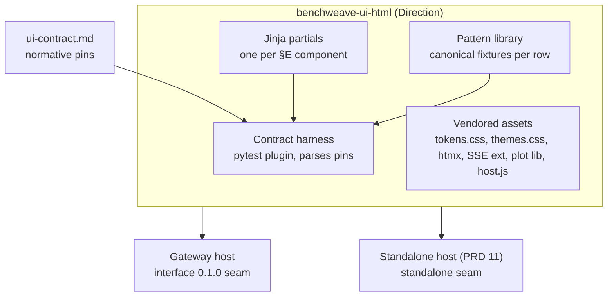
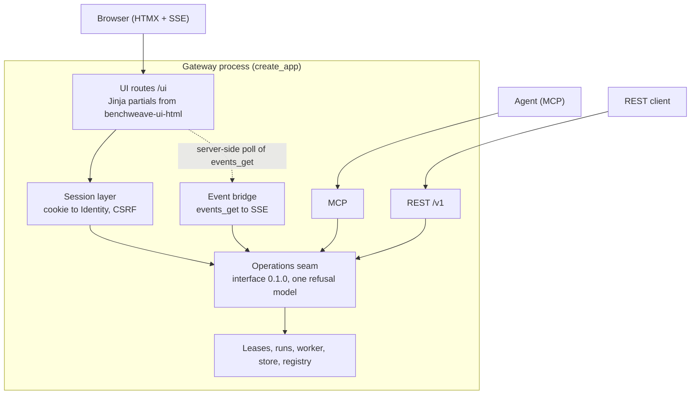

# Gateway Web UI (HTMX) and React Retirement: Requirements PRD

**Status:** Draft v0.2, 2026-10-01 — Q1–Q7 ruled; open items are dependency 7 and follow-up F1 · **Owner:** Stephen (madeinoz67) · **Scope:** gateway operator web UI, shared HTML renderer package, retirement of the React reference renderer · **Related:** [11-standalone-web-ui-prd.md](11-standalone-web-ui-prd.md), madeinoz67/benchweave#242, #243, #244

## Summary

The gateway has no web UI today. It serves REST at `/v1` and MCP at `POST /mcp` (FastMCP app mounted at `/` with its internal route at `/mcp`), plus the Textual TUI in `cli/render.py`. The React code in `ui/` is three things at once: the reference renderer that `ui-contract.md` is enforced against, the Storybook component library, and the source of the SDK's prebuilt `preview_assets` bundle. None of it is served by the gateway.

This PRD gives the gateway its first operator web UI, builds it on the same server-rendered HTMX renderer PRD 11 specifies for standalone, and retires React as the reference renderer in one cutover.

Headline positions (each is a requirement below, rulings in §9):

1. **One renderer, two hosts.** A separate package, **Direction (non-binding)** `benchweave-ui-html`, holds the Jinja partials, host script, vendored tokens and the Python contract harness. The gateway and the PRD 11 standalone host both depend on it. Neither host owns templates.
2. **Hard cutover, gated.** The HTMX renderer becomes the reference renderer. React, Storybook and the TS test suites are deleted in the same increment that the Python contract harness goes green on every machine-pinned row of `ui-contract.md`. There is no dual-maintenance period, and there is no window where the contract has no executable enforcement.
3. **The contract is already renderer-neutral.** `ui-contract.md` (#242) is normative and pins tokens, severities, safety rules, disabled reasons, the refusal mapping, the mode banner and eleven component rows. This PRD changes who enforces it, not what it says.
4. **No UI-private operations.** Every state change the UI makes is an interface 0.1.0 operation through the existing seam, with the caller's own principal and scopes. Where the UI needs something the interface lacks, that is an interface change, not a UI route.
5. **Device control goes through runs.** Interface 0.1.0 has no direct parameter write. Staging and applying on the gateway means `run_check` then `run_start` under a lease, not a POST that writes a register.
6. **Browser sessions are a new identity surface.** The gateway's principal/audience/scope tokens are bearer credentials. A browser must not hold one in script-readable storage, so the gateway needs a session mechanism that maps a cookie to a validated identity without widening it.

Out of scope for this draft: visual design beyond the contract, the standalone host itself (PRD 11), and changes to interface 0.1.0. Anything sketched is marked **Direction (non-binding)**.

## 1. Problem and evidence

1. **No browser surface on the gateway.** Operators reach the gateway through REST clients, MCP agents or the TUI. Lease state, run progress, events and evidence have no visual surface, and approvals (`change_submit`/`change_apply`) have no human-facing flow at all.
2. **The reference renderer is not deployable.** `ui/src/app/App.tsx` renders `DeviceWorkbench` from `compositions/fixtures.ts` with a hard-coded threshold. There is no data client, routing or auth. Building a gateway UI in React means building the SPA infrastructure from zero.
3. **Two renderers would drift.** PRD 11 commits standalone to HTMX. If the gateway went React, the project would maintain two renderers of one contract indefinitely, with the parity suite as the only defence.
4. **Enforcement is coupled to React.** `contract-enforcement.test.ts` and `contract-coverage.test.ts` parse `ui-contract.md` and assert against React components through testing-library. The contract is neutral, but its only executable gate is not. Drift obligation 12 names those files.
5. **The toolchain cost is real.** `ui/` pins Node 22, React 19.3, Vite 8.3, Storybook 10.6, Vitest 4.1, TypeScript 6.0 and ESLint 10, about 8.2k lines of TS/TSX, all for a renderer the gateway does not serve. The rest of the project is Python 3.13 and uv.

Evidence baseline: `madeinoz67/benchweave` main, read 2026-10-01. Re-measure at each increment's merge base.

## 2. Goals, non-goals and success measures

**Goals**

- G1. One HTML renderer package that both hosts consume, with the contract harness as its conformance gate.
- G2. A gateway operator UI over interface 0.1.0: benches, devices and plugin presentation, events, leases, runs, evidence, artifacts and administrative changes.
- G3. Retire React, Storybook and Node from the repository and CI without losing any contract pin, computed proof or accessibility check.
- G4. Browser access that preserves the interface's identity, scope and deduplication guarantees, with no new authority path.

**Non-goals**

- Multi-tenant or internet-facing deployment. The deploy posture stays local, single operator, loopback by default (`deploy/PERMISSIONS-REVIEW.md` §1).
- New interface operations, error codes or MCP tools. Gaps found here are raised upstream.
- A second design language. The tokens and rules are `ui-contract.md` §A–§F.
- A client-side application framework, a JS build step, or npm at runtime.
- Replacing the Textual TUI. It stays as the terminal surface.

**Success measures**

| Measure | Target |
| --- | --- |
| Contract enforcement | Every machine-pinned table in `ui-contract.md` (§A.1–§A.4, §B.1–§B.4, §C.1–§C.3, §D.1, §E.1–§E.4) is parsed and enforced by pytest against the Jinja renderer, fail-closed on parse errors, as the TS tests are today |
| React retired | `ui/` deleted; no Node job in CI; drift obligation 12 rewritten to name the Python gates |
| Proofs preserved | Series-colour contrast and CVD non-confusion proofs, lane edge-preserving decimation and the LTTB control test run in Python with the same pre-committed thresholds |
| Interface fidelity | Every state-changing UI action maps to exactly one interface 0.1.0 operation; a test enumerates UI routes and fails on any mutating route without a mapped operation |
| Refusal fidelity | All 15 §C.3 rows render through the UI for an induced instance of each code, including `no-response` with sent status `UNKNOWN` |
| Accessibility | WCAG 2.2 AA; axe clean in CI on every page template and pattern-library fixture, both themes |
| Interface checks | Interface checks I01–I12 unchanged and green; the UI adds no exemptions |
| Client weight | Same budget as PRD 11 Q6, shared because the assets are shared |

## 3. Actors and user stories

| Actor | Scope | Story |
| --- | --- | --- |
| Observer | `observe` | US1. As an observer, I open a bench and see its devices, their plugin-declared pages with live readings, and the event stream, without being able to change anything. |
| Observer | `observe` | US2. As an observer, when the event stream reports `event_gap`, I see a persistent warning naming the gap, not a silently resumed stream. |
| Operator | `control` | US3. As an operator, I take a lease on a bench, see its expiry, renew it deliberately, and release it. Closing the tab does not keep it alive. |
| Operator | `control` | US4. As an operator, I stage procedure inputs, run the check, see the check result, and start the run. A double-click or a resubmitted form starts one run, not two. |
| Operator | `control` | US5. As an operator, when I stage an energy-sourcing action, the confirm step states the effect, exact values with units and target before anything is sent. Turning an output off is one click, never confirmed. |
| Operator | `control` | US6. As an operator, I cancel a running procedure and see the run reach a terminal state from the gateway, not from my click. |
| Operator | `observe` | US7. As an operator, I open a finished run and read its evidence and artifacts, with digests shown. |
| Administrator | `admin` | US8. As an administrator, I submit a change, see that it needs independent approval, and cannot approve my own submission through the UI. |
| Administrator | `admin` | US9. As an administrator, I apply an approved change and the UI shows the generation increment, or the explicit failed/unknown record if the apply did not complete. |
| Maintainer | — | US10. As a maintainer, I change a row in `ui-contract.md` and the same pytest run fails until the Jinja partial and the pin agree. No Node toolchain is needed. |
| Plugin author | — | US11. As a plugin author, my plugin-ui 0.2.0 pages render the same on the gateway as in standalone, because it is the same renderer. |

## 4. Current state

| Area | What exists | Where | Effect on this PRD |
| --- | --- | --- | --- |
| Gateway app | One ASGI app; REST router at `/v1` registered before a catch-all FastMCP mount at `/` whose only route is `POST /mcp`; run worker; operations seam | `src/benchweave/interfaces/app.py` (`create_app`) | MCP is already at `/mcp` as interface-contract requires and PRD 11 SW-01 matches; UI routes must be registered before the catch-all mount (GW-01, GW-04) |
| Interface 0.1.0 | 20 operations, 17 MCP tools `stg_v1_*`, permissions `observe`/`control`/`admin`, 14 error codes, request-ID deduplication, scope-bound cursors | `standards/interface/0.1.0` | The UI's entire operation vocabulary; no direct device write exists |
| Identity | Local test issuer: HMAC tokens with principal, audience, scopes, expiry | `interfaces/identity.py` | Browser sessions must map onto this without exposing the token to script (§8 NFR-S) |
| Deploy posture | systemd unit, loopback bind, single operator, secret in a 0600 env file | `deploy/` | The threat model the UI inherits and must not widen |
| UI contract | Normative, renderer-neutral; machine-pinned tables with a fixed authoring rule | `docs/internal/ui-contract.md` | Unchanged in content; enforcement target changes |
| Reference renderer | React 19.3 components, compositions, preview app, ECharts 6.1.0, lucide-react | `ui/src/` | Ported, then deleted |
| Contract gates | L1 fixture pins and token-value equality; L2 per-component rendered-attribute pins | `ui/src/contract-coverage.test.ts`, `ui/src/contract-enforcement.test.ts` | Ported to pytest first; these define the cutover gate |
| Computed proofs | Series-colour contrast and CVD non-confusion; lane reduction; LTTB control | `ui/src/series-colors.test.ts`, `ui/src/components/plots/lane-reduction*.test.ts` | Ported with identical thresholds |
| Preview bundle | Prebuilt React site plus `inventory.json`, written into the SDK by `ui/scripts/write-preview-inventory.mjs` | `packages/sdk` (submodule) `preview_assets/` | Cannot be rebuilt once `ui/` is gone (§6 R-5, §9 Q4) |
| Wire schema | Preview document schema conformance-tested from the Python emitter and the TS decoder | `standards/plugin-ui-preview/<active>/` | TS decoder half retires; Python emitter half stays |
| Style guide | Implementation guidance written for React | `docs/internal/ui-styleguide.md` | Rewritten as Jinja implementation guidance |
| Standalone | PRD 11 specifies the same HTMX stack and partials for standalone | `11-standalone-web-ui-prd.md` | Consumes the shared package; SW-21, SW-22, SW-25 re-point to it |

## 5. Shared renderer package

Both hosts render from one package. A host supplies data and routes; the package supplies markup, styles, the host script and the proof that its markup meets the contract.

- UR-01. The package contains one Jinja partial per `ui-contract.md` §E.1 component (`button`, `numeric-input`, `rotary-control`, `reading-tile`, `alert-bubble`, `engineering-plot`, `digital-lanes`, `data-table`, `panel`, `mode-banner`, `confirm-action`) and a refusal-message partial for §C.3. Partials take plain data (dataclasses or dicts with a schema), never host objects.
- UR-02. The contract harness ships as a pytest plugin. It parses every machine-pinned table under its exact heading, fails closed on a missing heading, missing table, wrong header cells or wrong stated row count, and generates one assertion per required attribute, role, class hook and required-text item against each partial's canonical fixture. This mirrors the current L1/L2 split one for one.
- UR-03. A contract row with no partial or no canonical fixture fails the harness. Rows cannot appear without implementations, as today.
- UR-04. Token values in §A are asserted equal to the values parsed from the vendored `tokens.css` and `themes.css`, in both themes, in both directions.
- UR-05. Role assertions use an accessibility-tree query over the rendered HTML, not a CSS selector stand-in for roles. **Direction (non-binding):** Playwright for Python with axe-core injected, which also covers UR-09.
- UR-06. The pattern library renders every canonical fixture, every §B state, every §C.2 disabled reason and every §C.3 refusal on one page per component, in both themes. It replaces Storybook as the visual review surface. Hosts may mount it in development only; it is never served by a production gateway.
- UR-07. Plot rendering sits behind a host-owned wrapper with the closed interface `ui-contract.md` §E.1 and §E.2 define for `engineering-plot`. Series slot assignment, dash and symbol sequences, y-axis assignment, reference lines, acquisition disclosure and trace provenance are computed server-side in Python and emitted as data attributes, so the harness can assert them without executing chart code. The plot library choice is PRD 11 Q12.
- UR-08. `digital-lanes` edge-preserving decimation (§E.4.4, normative) runs host-side in Python. The lane-reduction and LTTB control tests are ported with their fixtures and thresholds unchanged.
- UR-09. axe runs in CI against every pattern-library page in both themes and fails on any violation at WCAG 2.2 AA.
- UR-10. Vendored assets are inventory-hashed and verified at serve time, as PRD 11 NFR-P3 states. One inventory serves both hosts.
- UR-11. The package has no dependency on either host and no runtime dependency beyond Jinja2 and MarkupSafe. Hosts own FastAPI, SSE and transport.
- UR-12. Icons are the §F set, vendored as inline SVG partials. `lucide-react` is not replaced by a JS icon runtime.
- UR-13. CI exports the pattern library as static HTML and renders a screenshot of every fixture in both themes, in the same Playwright run as UR-09. Both are published to the Great Docs site under the user guides on each package release (§9 Q6). Neither is committed to the repository or produced by hand. **Direction (non-binding):** screenshots as PNG at a fixed viewport, file names keyed by contract row and fixture so a guide link survives a re-export.

## 6. React retirement

The cutover is one increment (§10 G1). React is the reference renderer until the harness is green, and gone the moment it is. The order inside the increment is fixed: port gates, prove them red against an empty renderer, implement partials until green, then delete.

- R-1. Port `contract-coverage.test.ts` and `contract-enforcement.test.ts` to the UR-02 harness. Before any partial exists, the harness must fail on every row. A harness that passes against nothing is not a gate.
- R-2. Port `series-colors.test.ts` (contrast, severity non-confusion under both CVD models, adjacency) with the design record §6 thresholds verbatim. The proofs are about token values, not React, so they port without semantic change.
- R-3. Port the composition proofs (`safety-proof.test.tsx`, `reading-states-proof.test.tsx`, `DeviceWorkbench.*.test.tsx`) as pattern-library compositions with equivalent assertions. In particular, the R-ENERGISE-1, R-DEENERGISE-1 and R-PROTECT-1 behaviours and `confirm-action`'s guard-at-fire-time rule must be asserted on the HTMX implementation, including a guard arriving while armed.
- R-4. Delete `ui/`, the Node CI jobs, Storybook, `.storybook/`, and `package-lock.json` in the same change that makes R-1 to R-3 green.
- R-5. Preview is retired as a separate tool; the PRD 11 standalone host is how an author sees their UI (§9 Q4). Until the standalone host ships with mock transport (dependency 4a), the SDK's committed `preview_assets` bundle is frozen at its last React build: shippable, never rebuilt, and recorded as an obligation-7 exception with that ship as its exit. When it ships, the SDK's `preview-ui` command becomes a shim (R-9) and `preview_assets` is deleted from the SDK.
- R-9. The SDK `preview-ui` shim delegates to the standalone host's `serve` with mock transport when the standalone distribution is installed, and otherwise exits non-zero with a `snake_case:` prefixed error naming the install command. It never falls back to the frozen bundle once that is deleted. The change ships as a breaking SDK release with a changelog entry, since the command's behaviour and dependencies change.
- R-10. SRF-2 (what the author sees agrees with `check-ui`) holds by construction: the standalone host refuses at startup anything `check-ui` refuses, using the SDK's own validator bytes (PRD 11 SW-05, SW-40), never a copy. The SRF-2 agreement test moves to the standalone distribution and runs against the installed SDK version it depends on.
- R-6. Rewrite drift obligation 12 to name the Python harness, the pattern library and the ported proofs. The wire-schema obligation drops the TS decoder half; the Python emitter half stays.
- R-7. Rewrite `docs/internal/ui-styleguide.md` as Jinja implementation guidance. Where it recorded a React-specific choice, the HTMX implementation either keeps the behaviour or records an exception per the style guide's *Exceptions* section. The authority chain (contract wins) is unchanged.
- R-8. Severity label wording (`success` → "Normal") is a reference-renderer choice per the style guide. The HTMX renderer keeps the current labels so the cutover is invisible to operators.

## 7. Gateway functional requirements

Every UI route calls the gateway's existing operations seam with the session's identity. No route reaches the store, the worker or a plugin directly.

### (a) Composition and routing

- GW-01. UI routes are added in `create_app`, under one prefix (**Direction (non-binding):** `/ui`), registered before the catch-all MCP mount, as `/v1` is today. The MCP endpoint stays `POST /mcp` (interface-contract §transport); this PRD does not change it.
- GW-02. The UI is part of the gateway process and its lifespan. There is no separate UI server and no second port.
- GW-03. The UI is optional at runtime: a configuration flag disables the `/ui` router entirely, and a disabled UI is absent, not stubbed.
- GW-04. A routing test pins the composed app's path ownership: `/v1/*` reaches REST, `/ui/*` reaches the UI, `POST /mcp` reaches MCP, and no `/ui` or `/v1` path falls through to the catch-all mount. Registration order is a correctness property, so it is tested, not commented.

### (b) Operation mapping

- GW-10. The UI's mutating vocabulary is exactly: `lease_create`, `lease_renew`, `lease_release`, `run_check`, `run_start`, `run_cancel`, `change_submit`, `change_apply`. Its read vocabulary is the remaining twelve operations. A test enumerates mounted UI routes and fails on any mutating route that does not map to exactly one of these.
- GW-11. Errors are rendered through the §C.3 refusal partial from the interface error object, with `correlation_id` shown. The UI never rewrites a code into a softer one and never retries a mutating operation on the operator's behalf.
- GW-12. A mutating request with no interface answer renders the `no-response` row: severity critical, sent status `UNKNOWN`, and a reconcile action that calls `run_find` with the same `request_id`.
- GW-13. Every mutating form carries a server-generated `request_id`, fixed when the form is rendered. Resubmitting the same form, double-clicking, or retrying after `no-response` reuses that ID, so the interface's deduplication returns the same run rather than starting another (interface-contract §deduplication).
- GW-14. `not_found` renders as "unavailable to this caller" and never implies non-existence, per §C.3.

### (c) Benches, devices and plugin presentation

- GW-20. Bench list and bench pages from `bench_list` and `bench_get`; device lists and device pages from `device_list` and `device_get`.
- GW-21. Device pages render the plugin's plugin-ui 0.2.0 manifest, binding catalogue and presets with the shared renderer and the gateway's own presentation validator. Required panels the host lacks fail with `panel_unavailable`, optional ones appear as unavailable, as PRD 11 SW-41 states, so both hosts report the same features.
- GW-22. Readings are observations. A tile updates only from gateway-reported state, never from a submitted value (`reading-tile` row: no optimistic copy). Set evidence renders only when the gateway observed it (§E.3).
- GW-23. Staleness follows §B.4 from the reading's own timestamp, not from page age.

### (d) Events and live updates

- GW-30. A server-side bridge reads `events_get` per bench on the session's identity and republishes to the browser over SSE. The cursor never leaves the server.
- GW-31. `event_gap` raises a persistent warning on the bench page naming the gap's watermarks, and the bridge re-reads affected snapshots from a new cursor. It does not skip the gap.
- GW-32. `cursor_expired` restarts the listing and deduplicates by stable resource identity, without operator action, and records an advisory.
- GW-33. One bridge per (session, bench), bounded in count per session and torn down when the SSE connection closes. A closed tab stops all reads made on its behalf.
- GW-34. Live sample updates are coalesced; ARIA live regions announce state changes, not samples (PRD 11 SW-26).

### (e) Leases

- GW-40. Lease create, renew and release are explicit operator actions. The page shows holder, expiry and time remaining from the gateway's lease record.
- GW-41. The UI does not renew a lease in the background. A lease taken in a browser expires on the gateway's schedule if the operator stops renewing, including when the tab closes. Expiry warnings follow GW-44.
- GW-42. When the session's principal holds no lease on the bench, every control on that bench renders disabled with reason `no-authority` (§C.2), and the bench page shows the `no-lease` mode entry (§D.1).
- GW-43. Lease expiry while a run is active is shown as the gateway reports it. The UI does not infer run outcome from lease state.
- GW-44. Expiry warnings (ruled in §9 Q2) apply to leases and to the browser session alike. A persistent warning renders when remaining time falls to 20% of the duration or 2 minutes, whichever is reached first; it escalates to critical at 5% or 30 seconds, whichever is reached first. The warning names what is lost on expiry (for a lease holding manual work: "manual work on this bench will be ended by the safe transition") and carries the renew action. Renewal is always an explicit operator action (GW-41). The fixed floors are provisional until checked against the commissioned lease limits (G3 exit gate).

### (f) Runs, staging and energy safety

- GW-50. Staged inputs are form state on the server-rendered page, labelled *staged*, and are never sent to the gateway except as `run_check` or `run_start` input.
- GW-51. `run_check` precedes `run_start`. The start control is disabled until a check for the current staged input has returned, and any change to the staged input invalidates it.
- GW-52. Where the procedure or binding is energy-sourcing by R-ENERGISE-1, the start uses the `confirm-action` partial: effect, exact values with units, target, then a second explicit action. Guards are re-evaluated at fire time, server-side, against current lease and trip state.
- GW-53. Energy-removing actions are one action, never confirmed, never gated (R-DEENERGISE-1). This includes `run_cancel` where cancellation is the operator's route to a safe ending. No `no-authority` or `protection-active` disabling applies to them in the UI.
- GW-54. While a protective trip is active, energy-sourcing actions are disabled with `protection-active` (R-PROTECT-1). Trip reset is an administrative change (§(h)), never a run control.
- GW-55. Run pages from `run_get` show status, ownership and terminal state as the gateway reports them. Cancel shows "cancel requested" until the run reaches a terminal state.
- GW-56. A manual-mode `run_start` is refused in the UI, before the request is sent, when the procedure's declared duration bound (execution safety policy `max_duration_ms`) exceeds the time remaining on the lease or on the session, whichever is shorter. The refusal states the bound, both remaining times and the action that clears it (renew the lease, or mint a longer session). Where the binding also has an approved unattended grant, the refusal names gateway-owned mode as the route for runs that must outlast an operator's attention. The gateway's own start checks stay authoritative; this guard only stops the UI from starting manual work it can already see will be cut short. Depends on dependency 7 (§11).
- GW-57. Lease expiry is a deliberate dead-man's switch for manual work (interface-contract §5–6): leased manual work ends through the approved safe transition on expiry. Nothing in the UI weakens it: no background renewal, no automatic session extension, no retry of an expired renewal.

### (g) Evidence, artifacts and documents

- GW-60. Evidence, artifact and document views from `evidence_get`, `artifact_read` and `document_get`, showing digests. Artifact reads are chunked through the interface's limits; the UI does not reassemble beyond `payload_too_large` bounds.
- GW-61. Downloads are served by the gateway after the same operation and scope checks, never from a direct store path.

### (h) Administration

- GW-70. Change submission, review and apply from `change_submit`, `change_get` and `change_apply`, behind `admin` scope.
- GW-71. The UI does not offer apply on a change whose approval record names the session's own principal as approver of its own submission. The gateway's independence check stays authoritative; this is presentation only.
- GW-72. A failed or uncertain apply renders the explicit failed/unknown change record and the inhibited-control state it causes, persistent until reconciled.

### (i) Mode banner and gateway identity

- GW-80. The mode banner partial renders on every page per §D. A full-authority gateway page renders no banner. `no-lease` renders on bench and device pages when GW-42 applies. `no-policy` renders when the gateway reports no policy engine. `no-gateway` and `simulated` never render on the gateway.
- GW-81. Every page shows the gateway identity and version from `gateway_info` and the session's principal and scopes, so an operator can tell which gateway and which authority they are acting with.

### (j) Session establishment

Ruled in §9 Q1. Option 2 now, OAuth later (F1).

- GW-90. `benchweave ui-login` (**Direction (non-binding)**) mints a login link carrying a random, single-use, opaque code. The code maps server-side to the identity the CLI authenticated with; it is not the bearer token and does not encode one.
- GW-91. The code expires after a short fixed lifetime (**Direction (non-binding):** 60 s) and on first use, whichever comes first. A second presentation of a used or expired code is refused with `unauthenticated` and logged.
- GW-92. Exchange is a single request that sets the session cookie and redirects to a URL with no code in it, with `Referrer-Policy: no-referrer` on the exchange response, so the code does not persist in history, logs or `Referer` (NFR-S3).
- GW-93. The CLI can mint a narrower session than its own identity (fewer scopes, shorter expiry), never a wider one (NFR-S2). **Direction (non-binding):** `--scope observe` for a read-only screen.
- GW-94. Logout and session expiry invalidate the session server-side. Sessions are stored server-side so a gateway restart or secret rotation invalidates them all.
- GW-95. A lease never outlives the session that holds it. The UI refuses `lease_create` and `lease_renew` when the resulting lease expiry would fall after the session's expiry, rendered disabled with the session expiry stated and the action that clears it (`ui-login` for a longer session). Reason: an expired session cannot renew (interface-contract §5), so such a lease would lapse unrenewable and end manual work with the operator still present. Session and lease lifetimes otherwise stay independent; the session is never extended to fit a lease.

## 8. Non-functional requirements

**Security (NFR-S).** The gateway's threat model (`deploy/PERMISSIONS-REVIEW.md` §1) is single operator, loopback. The browser adds one attacker the REST and MCP surfaces do not have: another page in the same browser, via cross-site requests or DNS rebinding onto the loopback port. Here that means driving a bench under the operator's lease.

- NFR-S1. The bearer token never reaches the browser in a script-readable form. The session cookie is `HttpOnly`, `SameSite=Strict`, `Secure` when served over TLS, path-scoped to `/ui`, and server-side bound to a validated `Identity` (principal, audience, scopes, expiry).
- NFR-S2. A session never outlives the identity it was created from, and never holds more scopes than that identity. Narrowing is allowed; widening is not.
- NFR-S3. Session establishment follows GW-90 to GW-94. The gateway secret and any token used to establish a session never appear in URLs that persist (history, logs, `Referer`).
- NFR-S4. CSRF token on every state-changing route, sent by htmx via `hx-headers`, checked server-side alongside `Origin`.
- NFR-S5. Trusted-Host check on every `/ui` request (DNS rebinding).
- NFR-S6. Strict CSP: `script-src 'self'`, no inline script, no `eval`; `htmx.config.allowEval = false`, `selfRequestsOnly = true`. No CORS on `/ui`.
- NFR-S7. Network exposure follows the gateway's posture: loopback by default, TLS required for any non-loopback bind (interface-contract §network). The UI adds no separate listener rules.
- NFR-S8. Every UI action is audited by the operation it maps to, under the session's principal. The UI adds no audit stream of its own and must not attribute actions to a shared service identity.
- NFR-S9. Plugin presentation content is data. No plugin-supplied JS, CSS or HTML is rendered (plugin-ui 0.2.0 host-owned rendering).

**Operational safety (NFR-O).** Operational continuity first.

- NFR-O1. No device-affecting operation on page load, reconnect, SSE resume, preset selection or session refresh.
- NFR-O2. Gateway `unavailable` and transport loss render as persistent critical states, and observation and protection visibility are marked degraded (§C.3), not hidden behind a spinner.
- NFR-O3. A browser disconnect never cancels a run, releases a lease or stops a capture. Those are explicit operations.
- NFR-O4. Enabling the UI does not change gateway behaviour for REST or MCP clients, and disabling it (GW-03) is a no-op for them.

**Packaging (NFR-P).**

- NFR-P1. `benchweave-ui-html` is a separate wheel with its own version, depending on Jinja2 and MarkupSafe only (UR-11).
- NFR-P2. The gateway and PRD 11's standalone distribution pin compatible versions of it. A contract change bumps the package, and both hosts move together.
- NFR-P3. Python 3.13, uv. The repository needs no Node toolchain after G1.
- NFR-P4. Vendored assets as UR-10; versions aligned with PRD 11 NFR-P2.

**Quality (NFR-Q).**

- NFR-Q1. WCAG 2.2 AA; keyboard parity with pointer; axe clean on every gateway page template in both themes.
- NFR-Q2. Every §C.3 refusal path is induced and rendered in a test, per code.
- NFR-Q3. Interface checks I01–I12 run unchanged; the UI routes are added to the I02 (no principal spoofing, no cross-bench reads) and I09 (scope-bound cursors) suites.
- NFR-Q4. Error text prefixes are an API (STD-4 posture).

## 9. Decisions

All seven questions were ruled by the owner on 2026-10-01. Each entry records the ruling and its reason; the requirements it produced are cross-referenced.

**Q1. Browser session establishment. Ruled 2026-10-01: CLI-minted single-use login link.** **Direction (non-binding)** `benchweave ui-login` mints a short-lived, single-use link bound to the operator's identity. The gateway exchanges it for a session cookie (NFR-S1) and redirects to a clean URL. OAuth authorization code flow is deferred, not rejected: it is tracked as follow-up F1 (§12) and becomes required when its trigger is met. Requirements GW-90 to GW-94 specify the ruled mechanism.

**Q2. Expiry warnings. Ruled 2026-10-01: the later of a percentage or a fixed floor.** Warn at 20% remaining or 2 minutes, whichever comes first; critical at 5% or 30 seconds, whichever comes first. A percentage alone gives a 24-second warning on a 2-minute lease and 48 minutes of noise on a 4-hour lease; the floor guarantees a minimum reaction window. Applies to leases and sessions (GW-44). Ruled alongside it: GW-56 (manual start refused when the run's bound exceeds the remaining lease or session), GW-57 (expiry stays a dead-man's switch) and GW-95 (no lease outlives its session). The fixed floors are provisional until checked against commissioned lease limits.

**Q3. MCP path. Ruled 2026-10-01: `/mcp` on both hosts.** Already true for the gateway: interface-contract requires `POST /mcp`, and `create_app` serves it there by mounting the FastMCP app at `/` with its internal route at `/mcp`. No client-facing change is needed. The remaining work is GW-04, which pins path ownership so the catch-all mount cannot swallow `/ui` or `/v1`. Moving the mount itself to `/mcp` is not recommended: Starlette's mount matching would redirect `POST /mcp` to `/mcp/` with a 307, which not every MCP client follows.

**Q4. Where preview lives after React. Ruled 2026-10-01: the standalone host is the preview.** There is no separate preview tool or preview mode. An author visualises their UI by running the standalone server against their plugin. With a device attached it runs on the real transport; without one it runs on mock transport (the SDK's `MockHost` scripted transfers), which also drives states a working bench rarely shows (stale, critical, trip). The difference is the transport, not the server, and the mode banner follows the data: `simulated` on mock transport, never on real hardware (§D.1). The SDK keeps validation (`check-ui`) and its dependency set (PKG-1/PKG-2) unchanged; `preview-ui` becomes a shim (R-9). Until the standalone host ships with mock transport, the React `preview_assets` bundle is frozen in the SDK (R-5).

**Q5. Package location. Ruled 2026-10-01: this repository, `packages/ui-html`.** The package sits beside the contract it enforces, so a contract-table edit, its partials and its pins land in one change (drift obligation 12). It is a plain directory and a uv workspace member, not a submodule. The gateway consumes it as a workspace path dependency; the standalone host in the SDK repository consumes the published wheel at a pinned version (NFR-P2). A contract change therefore reaches standalone through a package release and a pin bump in the SDK repository, never through a copied template.

**Q6. Pattern library exposure. Ruled 2026-10-01: static export on the docs site, with rendered screenshots.** The pattern library (UR-06) is exported as static HTML and published on the Great Docs site under the user guides, replacing what Storybook offered externally; no running gateway or standalone host is needed to browse it. Screenshots of every fixture in both themes are generated by the same Playwright run that does the accessibility checks (UR-05, UR-09) and published alongside, so guides can embed them as images. Both are build outputs from CI, never hand-captured, so they cannot drift from the partials (UR-13). The screenshots also give PRD 11 Q2's deferred visual-regression option a baseline to start from, without committing to it here.

**Q7. Sequencing against PRD 11. Ruled 2026-10-01: G1 first.** The shared package and the contract harness land before either host builds on the partials. With a hard cutover, the harness is the only executable enforcement of the contract once React is deleted, so it has to exist first. PRD 11 I1 can start its seam, REST and MCP work in parallel, since those do not need partials; its HTMX shell and device page consume the package from G1's first release.

## 10. Suggested increments

Four increments, each shippable and each gated on the one before. Read-only before control, control before administration.

| # | Scope | Requirements | Exit gate |
| --- | --- | --- | --- |
| G1 | Shared package in `packages/ui-html` and React cutover: partials for all eleven §E components and §C.3, contract harness, ported proofs, pattern library with static export and screenshots, axe in CI; then delete `ui/` | UR-01–13, R-1–R-8, NFR-P1–P4 | Harness proven red against an empty renderer, then green on every pinned table; series-colour, lane and LTTB proofs green with unchanged thresholds; safety compositions green including guard-while-armed; axe clean in both themes; `ui/` and Node CI removed in the same change; pattern-library export and screenshots published to the docs site, so nothing Storybook showed externally goes dark at the cutover; obligation-7 exception for the frozen bundle recorded with dependency 4a as its exit |
| G2 | Read-only gateway UI: session layer, benches, devices, plugin pages, event bridge, runs, evidence, artifacts, documents, mode banner | GW-01–04, GW-10–14, GW-20–23, GW-30–34, GW-55, GW-60–61, GW-80–81, GW-90–94, NFR-S1–S9, NFR-O1–O4, NFR-Q1–Q4 | An `observe`-scoped session sees every read view and has no mutating control; `event_gap` and `cursor_expired` induced and rendered; route-mapping test green; I02 and I09 extended to `/ui` and green; F1 tracking issue raised; GW-04 routing test green; used, expired and replayed login codes refused; no code observable in history, logs or `Referer` after exchange |
| G3 | Control: leases, staged inputs, `run_check`/`run_start`, energy confirmation, cancel, expiry guards | GW-40–44, GW-50–57, GW-95 | Double-submit starts one run; `no-response` reconciles via `run_find`; confirm states effect, values and target, and refuses at fire time when a trip arrives while armed; cancel and output-off are ungated with no lease and during a trip; manual start refused when the bound exceeds remaining lease or session time; lease create/renew refused when it would outlive the session; warning thresholds tested at both floors and both percentages; floors confirmed against the commissioned lease limits; dependency 7 resolved |
| G4 | Administration: change submit, review, apply; failed/unknown change records | GW-70–72 | Self-approval not offered; failed apply renders the inhibited state until reconciled |

## 11. Dependencies

| # | Dependency | Status | Effect on this PRD |
| --- | --- | --- | --- |
| 1 | `ui-contract.md` renderer-neutral contract | Landed: [#242](https://github.com/madeinoz67/benchweave/issues/242) | The harness target. Slice-2 safety behaviours and slice-3 series rows are normative and enforced from G1 |
| 2 | Limiting state, measured/set/staged, staleness, plot axes, processed data | Raised: [#243](https://github.com/madeinoz67/benchweave/issues/243) | GW-22 and GW-23 follow the current §B.3, §B.4 and §E.3 rows; later rows land through the harness like any contract edit |
| 3 | `digital_lanes` plot kind | Raised: [#244](https://github.com/madeinoz67/benchweave/issues/244) | `digital-lanes` partial implements §E.4 in G1; plugins declare it when plugin-ui accepts it |
| 4 | PRD 11 standalone host | Draft | Consumes `benchweave-ui-html`; SW-21, SW-22 and SW-25 re-point to the package |
| 4a | PRD 11 standalone host as the author's preview | To add to PRD 11 | Required by the Q4 ruling. Mock transport selectable without hardware; the nine baseline scenarios re-expressed as `MockHost` transfer scripts shipped with the host; `simulated` banner on mock transport only; no write on page load (SW NFR-O3) on either transport; when the presentation validates but the adapter fails to import or load, pages still render their layout with device operations `not_ready` and the load diagnostic shown, so an author can see a UI before the adapter works. Its ship is the exit for R-5's frozen bundle and the start of R-9's shim |
| 5 | Plot renderer ruling | PRD 11 Q12, open | UR-07 is renderer-agnostic by design; G1 can ship with ECharts 6.1.0 and swap behind the wrapper |
| 6 | Gateway identity provider | Not planned | Gates follow-up F1 (§12) |
| 7 | Procedure duration bound visible to a client before start | Unverified against interface 0.1.0 | GW-56 needs the run's `max_duration_ms` before `run_start`. If `run_check` or `document_get` on the binding does not expose it, raise an interface issue; the UI must not read it from the store or derive it locally. Until resolved, GW-56 is unenforceable and G3 cannot exit |

## 12. Deferred follow-ups

Items ruled out of this PRD's scope that must not be lost. Each has a trigger; when the trigger is met, the follow-up becomes a requirement in whatever PRD or increment is active, not a backlog note.

| # | Follow-up | Deferred by | Trigger | Tracking |
| --- | --- | --- | --- | --- |
| F1 | Replace CLI-minted login links with OAuth authorization code flow for browser sessions, aligned with interface-contract's MCP OAuth resource-server requirements (protected-resource discovery, audience validation). The session layer (GW-90–94) is replaced; NFR-S1, NFR-S2 and NFR-S4 carry over unchanged. | §9 Q1 ruling, 2026-10-01 | Any of: the gateway gets an identity provider other than the local test issuer in `identity.py`; MCP OAuth is implemented; a non-loopback deployment is supported; a second human principal needs browser access to one gateway | To raise as an upstream issue labelled `deferred`, linked here before G2 merges |

G2's exit gate includes confirming that F1's tracking issue exists and links back to this section.
