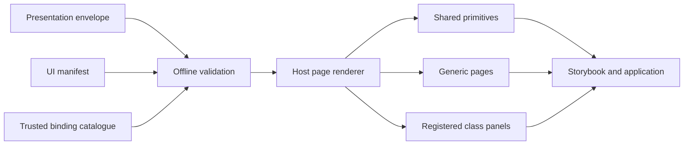

# BenchWeave UI style guide and workbench design

**Status:** Approved design for implementation planning

**Date:** 14 September 2026

**Audience:** UI engineers, plugin authors, reviewers, administrators and AI coding agents

**Related contracts:** Plugin UI 0.1.0, OTDP 0.3.0, adapter API 1.1, interface 1.1.1

## 1. Decision

Build a React and TypeScript UI foundation with Vite and Storybook. Storybook is the executable source of truth for the design system. This document is the durable human and AI reference.

The visual direction is **Layered Precision**: a modern digital-instrument interface with raised grouped surfaces and controls, recessed plots and dense data surfaces, technical typography, and restrained depth. Light and dark themes use the same component geometry and semantics.

Device plugins remain declarative. The host validates plugin presentation resources and renders them with host-owned components. A plugin may select versioned host panels, but it does not ship arbitrary browser code. This boundary provides plug-and-play presentation without weakening security, accessibility, compatibility or visual consistency.

The style system applies to operator, workbench and administrative interfaces.

## 2. Product fit

BenchWeave primarily serves test engineers, integration authors, bench owners and AI-assisted operators. The UI therefore prioritises:

- accurate values, explicit units and visible data quality;
- rapid interpretation of live and retained engineering data;
- clear separation of observation, staged input and authorised action;
- unmistakable simulation, authority, lease, approval and safety state;
- compact layouts suitable for engineering laptops and large bench displays;
- repeatability across device classes and third-party plugin declarations;
- recoverable workspaces and evidence suitable for review.

The interface must feel modern, but it must not trade clarity for decorative novelty or imitate physical equipment so closely that control behaviour becomes ambiguous.

## 3. Deliverables

The initial implementation will produce:

1. A React, TypeScript, Vite and Storybook foundation.
2. Shared Layered Precision design tokens and matched light/dark themes.
3. A workbench component catalogue covering primitives, engineering data, controls, feedback and application compositions.
4. Host-owned examples that render the plugin UI 0.1.0 page and binding kinds.
5. Representative operator and administrative compositions.
6. A representative application mock-up using the production components and tokens.
7. Workbench setup, layout, save and load compositions.
8. SDK and local-development fixtures and guidance.
9. This maintained internal guide, expanded with implementation rules and component usage as the system lands.

The application mock-up is a maintained Storybook composition, not a disconnected image. Static captures may be generated for documentation, but the coded composition is authoritative.

## 4. Visual language

### 4.1 Layered Precision

Surface depth communicates function:

- the application canvas is the lowest layer;
- grouped panels and actionable cards are raised;
- plots, waveforms, dense tables and logs are recessed;
- buttons and direct manipulation controls have restrained tactile elevation;
- focused, pressed and disabled states change depth and border treatment consistently.

Elevation must remain subtle enough for dense technical use. Do not add shadows independently inside product features. Use named elevation tokens.

### 4.2 Themes

Light and dark themes share component dimensions, spacing, typography, state names and interaction behaviour. Only colour and luminance tokens change.

- Light theme is suited to general and daylight use.
- Dark theme is fully supported for low-light bench operation.
- The initial theme follows the operating-system preference.
- A manual user choice overrides the default and persists locally.
- Printed and exported evidence uses a separate high-legibility presentation treatment.

### 4.3 Typography and numbers

Use a contemporary sans-serif for interface text and a tabular monospaced face for readings, timestamps, identifiers, coordinates and cursor values. Numeric components must:

- preserve significant information without implying false precision;
- keep value and unit visually associated;
- use tabular figures to prevent layout movement;
- expose full precision and provenance where a compact display rounds;
- format engineering prefixes consistently;
- never use font size alone to signal severity.

### 4.4 Severity and glow

Glow is a semantic signal reserved for abnormal or attention-required state. A normal reading does not glow.

| State | Primary treatment | Required redundant signals |
| --- | --- | --- |
| Advisory | Blue local glow | Information icon, label and message |
| Warning | Amber local glow | Warning icon, border, label and threshold |
| Critical | Red local glow | Critical icon, stronger border, label and required action |
| Protective trip | Magenta-red local glow | Trip icon, state label, inhibited-control treatment and recovery guidance |

The glow originates beneath or immediately around the affected reading or control. It must not wash across unrelated panels. Intensity reflects severity, not value magnitude. Reduced-motion and high-contrast modes retain the border, icon, label and message when glow or animation is unavailable.

## 5. Architecture and ownership

The host owns:

- component implementation and design tokens;
- schema and binding validation at the UI boundary;
- device connections, acquisition and retained observations;
- authentication, authorisation, leases, approvals and run state;
- the registry of supported versioned class and custom panels;
- accessibility, visual regression and compatibility testing.

Plugins own declarative presentation resources tied to their admitted descriptor. They may declare pages, bindings, assets, plots, required UI features and exact panel identifiers. They cannot grant permission, bypass policy, start independent polling, or cause arbitrary frontend code to execute.

The renderer resolves only supported, registered page and panel types. Version identifiers are exact compatibility boundaries.

## 6. Plugin presentation mapping

The plugin UI 0.1.0 contract maps to host surfaces as follows:

| Contract concept | Host rendering |
| --- | --- |
| `configuration` page | Schema-driven configuration form, preset selection and explicit apply workflow |
| `readings` page | Reading grid or table with optional time-series plots |
| `dataset` page | Dataset table and compatible waveform or specialised plot |
| `class_panel` page | Versioned host-owned device-class composition |
| `custom_panel` page | Explicitly registered host-owned extension panel |
| `configuration` binding | Staged values and validated action request |
| `procedure` binding | Authorised procedure launcher and progress state |
| `observation` binding | Scalar or categorical reading with quality metadata |
| `dataset` binding | Retained multidimensional result with declared variables |
| `time_series` plot | Numeric scalar value against receipt time in seconds |
| `waveform` plot | Numeric vector axes and one or more declared numeric traces |

Optional unavailable panels degrade to other valid generic pages where available. A required unavailable panel blocks that page and reports a stable diagnostic. Unsupported required features, invalid plots, unresolved bindings, incompatible units and malformed resources fail closed.

## 7. Component catalogue

### 7.1 Foundations

- semantic colour and severity palettes;
- typography and numeric formatting;
- spacing and responsive grids;
- elevation, recess and glow tokens;
- border, radius and focus tokens;
- iconography and status symbols;
- motion, reduced-motion and transition rules;
- desktop, compact-laptop and tablet breakpoints.

### 7.2 Actions

- primary, secondary, tertiary and destructive buttons;
- icon, split and grouped buttons;
- protective and emergency actions;
- confirmation, pending, busy and completed states;
- disabled-by-permission, disabled-by-policy and disabled-by-state variants;
- tooltips and keyboard shortcuts where supported.

### 7.3 Inputs

- text and search fields;
- numeric input with unit, bounds and step;
- select and searchable select;
- checkbox, radio and switch;
- slider and bounded range;
- segmented control;
- date, time and duration fields;
- file and dataset selectors;
- schema-driven field groups and inline validation.

### 7.4 Instrument controls

- rotary knob and stepped dial;
- staged set-point control;
- channel and range selectors;
- output and enable controls;
- trigger mode, level and edge controls;
- acquisition transport controls;
- marker and cursor controls;
- switch-matrix routing cells;
- keypad entry for precise values.

A knob, dial or slider changes a staged value. It does not emit an uncontrolled stream of device commands while dragged. Applying a value is a separate, explicit request that displays unit, bounds, policy feedback and authority state.

### 7.5 Readings and status

- scalar reading;
- Boolean and enumerated state;
- minimum, maximum, average and aggregate reading;
- tolerance band and threshold state;
- freshness, uncertainty and provenance;
- simulation and evidence labels;
- connection, identity, lease and authority indicators;
- severity glow variants.

### 7.6 Data visualisation

- time-series trend;
- multi-axis graph;
- analogue waveform;
- digital trace and decoded event lanes;
- spectrum and spectrogram-ready surface;
- sweep and transfer curve;
- Smith chart or polar extension;
- histogram;
- thresholds and tolerance regions;
- markers, cursors and delta measurements;
- zoom, pan, reset, legend and export controls;
- loading, sparse, partial, stale and empty data states.

Meaning cannot depend on colour alone. Trace identity uses labels and, where necessary, line forms or markers. Axes, units, sampling basis, time basis and freshness remain visible.

### 7.7 Tables and structured data

- compact and comfortable density;
- sorting, filtering and column visibility;
- sticky headers and expandable rows;
- row selection and bulk action boundaries;
- channel and routing tables;
- event and audit logs;
- key-value metadata;
- virtualised large datasets;
- copied/exported data with units and provenance.

### 7.8 Feedback and navigation

- inline validation, alert, banner and toast;
- progress, skeleton and busy states;
- empty, partial, stale and disconnected states;
- trip and recovery guidance;
- application shell and primary navigation;
- breadcrumbs, tabs and command palette;
- panel, drawer, modal and toolbar;
- card, section and resizable work area.

### 7.9 Domain compositions

- device identity and connection header;
- lease and control-authority summary;
- configuration editor and preset picker;
- readings grid;
- acquisition and trigger panel;
- procedure launcher and run timeline;
- evidence and final-safe-state report;
- registry package and admission review;
- policy, approval, identity and audit administration.

## 8. Device-class coverage

The workbench will include representative stories for all current OTDP classes:

- DC power supply;
- digital multimeter;
- oscilloscope;
- logic analyser;
- function generator;
- electronic load;
- source-measure unit;
- data acquisition;
- embedded controller;
- switch matrix;
- spectrum analyser;
- vector network analyser.

These stories prove visual and contract coverage. They do not claim that runtime bridges or physical hardware implement every illustrated action.

## 9. Operator and administrative consistency

One shared token and component package serves operator and administrative applications. Operator surfaces prioritise live state, readings, controls, acquisition and procedure progress. Administrative surfaces cover registry packages, plugin admission, device inventory, physical bench configuration, identities, roles, policies, approvals, audit, updates and recovery.

Density may vary, but state semantics do not. Warning, disabled, pending, approved, revoked, stale and failed must look and behave consistently. Administrative cards do not glow in normal operation. Rejected admission, revoked packages, policy conflicts and critical service state use the same severity system as instrument alerts.

Administrative mutations remain visually distinct from ordinary control, show affected scope, and use the review or confirmation required by the core contract.

## 10. Workbench layouts

### 10.1 Separate documents

A **physical bench** defines devices, wiring, qualification, policy and authority. A **UI workbench** defines presentation: panels, placement, size, tabs, selected channels, plot view and table preferences.

Moving or saving a UI panel cannot alter physical configuration, safety policy, plugin settings, an approved procedure or control authority.

### 10.2 Layout model

Use a constrained dock-and-grid system instead of unrestricted pixel positioning. It supports:

- creation, rename, duplicate, save, load, export and archive;
- host templates, device-class templates and an empty canvas;
- add-panel catalogue sourced from host tools and validated plugin pages;
- drag, resize, dock, split, tab-stack, maximise and restore;
- keyboard-accessible placement;
- edit and operate modes;
- responsive reflow with component minimum sizes;
- compact laptop, tablet and large-display arrangements;
- multi-monitor-friendly restoration without assuming exact monitor geometry;
- undo, redo, reset-to-template and draft recovery.

### 10.3 Persistence

Workbench layouts are versioned documents with stable panel instance identifiers. Persist:

- panel type and registered version;
- plugin page or host-panel reference;
- grid placement, split and tab-stack membership;
- supported presentation preferences;
- owner, visibility, revision and timestamps.

Do not persist credentials, active leases, uncommitted device values or control authority. Device configuration presets and procedure definitions remain separate versioned resources.

Support personal layouts, bench-shared layouts and administrator-managed templates with explicit ownership. Autosave a recoverable draft while retaining explicit named revisions for shared layouts.

When a device, plugin page or panel is unavailable, retain its intended placement, explain the cause, and offer only compatible replacements. Migration between layout versions must be deterministic and must not silently introduce control behaviour.

## 11. SDK and local development

The SDK workflow must let a plugin author validate presentation without hardware access.

### 11.1 Contract reuse

Canonical JSON Schemas remain the source of truth. Generate TypeScript types and browser-compatible runtime validators from the pinned schemas. CI rejects generated-code drift. Do not maintain parallel handwritten contract models.

### 11.2 Scaffold and preview

Extend the `benchweave-sdk new --with-ui` path around its existing minimal readings manifest and binding catalogue. A presentation-development command will:

1. validate the envelope, manifest, catalogue and referenced resources;
2. load them into the real host renderer;
3. provide deterministic host fixtures;
4. expose the result in a local workbench and generated Storybook stories.

Plugin authors declare resources; they do not create React components.

### 11.3 Mock host adapter

The local adapter supplies deterministic examples of:

- admitted identity and firmware compatibility;
- observer, controller and administrator permissions;
- lease and approval state;
- scalar readings and retained datasets;
- procedures and event timelines;
- normal, loading, stale, partial and disconnected operation;
- warning, critical, trip and recovery;
- unavailable required and optional panels.

Local preview is prominently marked as simulated and cannot connect to physical equipment by default.

### 11.4 Registered panel development

Host-owned specialised panels use a separate harness. Each panel declares supported contract versions and receives only the host presentation interface. Compatibility tests cover supported versions, invalid inputs, data-quality states and theme/accessibility requirements.

### 11.5 Developer loop

1. Scaffold or update presentation resources.
2. Run `benchweave-sdk check-ui`.
3. Launch the deterministic local presentation preview.
4. Review generated stories in light, dark and fault states.
5. Run UI conformance and accessibility checks.
6. Package exact resources and update hashes.
7. Verify production-host compatibility during admission testing.

The same manifest must produce the same page structure in SDK preview and the production host.

## 12. Runtime states and failure handling

Runtime values retain value, unit, timestamp, freshness, quality and provenance through to the component boundary.

- Stale, partial or disconnected data may remain visible but must be unmistakably marked.
- Permission, lease, approval, policy and transport failures remain distinct states.
- A failed request never optimistically displays an unverified device state as applied.
- Unknown final physical state is not represented as safe.
- Critical and trip states suppress decorative animation and prioritise required action.
- Recovery messages state what is known, what is inhibited and the next supported action.
- Browser loss does not terminate a gateway-owned procedure.

## 13. Accessibility and interaction rules

- Meet WCAG 2.2 AA for supported application flows.
- Support keyboard-only operation, including layout editing.
- Provide visible focus at every elevation level.
- Give controls programmatic names, values, bounds and units.
- Do not encode state through colour, glow, position or motion alone.
- Respect reduced motion, increased contrast and browser zoom.
- Keep target sizes suitable for laptop and touch-assisted tablet use.
- Announce important state changes without flooding assistive technology during live acquisition.
- Preserve precise numeric entry alongside knobs, dials and sliders.

## 14. Storybook organisation

Organise stories by user purpose:

1. Foundations
2. Actions and inputs
3. Instrument controls
4. Readings and state
5. Plots and datasets
6. Tables and logs
7. Feedback and recovery
8. Layout and navigation
9. Plugin page renderers
10. Device-class panels
11. Operator compositions
12. Administrative compositions
13. Workbench setup and layouts
14. SDK plugin specimens

Every applicable component story includes light and dark, default and focus, loading, empty, disabled, permission-limited, stale, warning, critical and error variants.

## 15. Verification

Implementation acceptance requires:

- component unit and interaction tests;
- Storybook accessibility checks;
- automated light/dark visual regression;
- keyboard-only coverage;
- contrast checks including glow states;
- exact contract fixtures for all page and binding kinds;
- representative stories for all twelve device classes;
- responsive checks at defined breakpoints;
- unit, prefix, range and precision formatting tests;
- proof that colour and glow are never the sole status indicator;
- SDK preview and production-renderer structure parity;
- workbench layout round-trip and migration tests;
- missing plugin and unsupported panel recovery tests.

## 16. Initial non-goals

- Allowing plugin packages to execute arbitrary browser code.
- Making the browser authoritative for polling, safety or procedure lifecycle.
- Claiming hardware support from a Storybook specimen.
- Replacing commissioned physical-bench configuration with UI layout state.
- Providing unrestricted pixel-perfect dashboard placement.
- Treating visual confirmation as approval to operate equipment.
- Building a public plugin marketplace.

## 17. Human and AI implementation rules

Humans and AI agents extending the UI must:

- reuse existing tokens and components before proposing a new variant;
- add component states and stories alongside behaviour;
- map plugin content through validated host renderers;
- keep observation, staged input and committed action visibly separate;
- use semantic state names rather than raw colours;
- include units, bounds, data quality and authority where relevant;
- update this guide when a durable design rule changes;
- record an explicit compatibility decision for new panel versions;
- avoid local styling that makes operator and admin surfaces diverge.

Exceptions require a documented user need, the reason existing components are insufficient, accessibility and safety impact, compatibility scope and a test plan.
