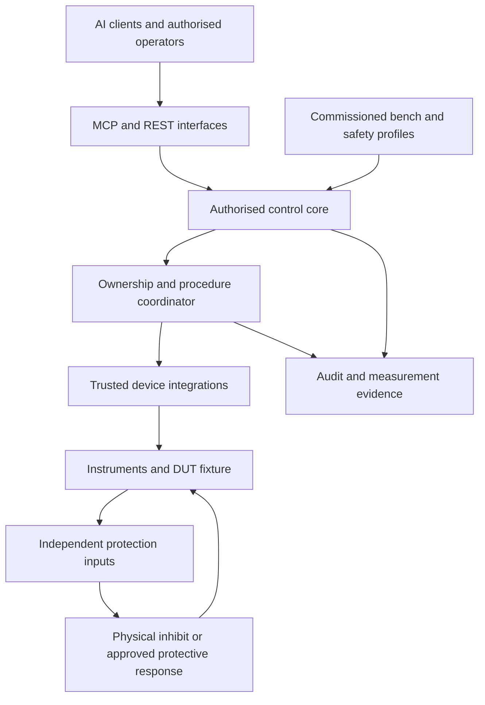

# Smart Test Gateway — Architecture v1.5

**Status:** Consolidated architectural baseline at the stated scope; design review complete, implementation and bench qualification not performed  
**Date:** 9 September 2026  
**Basis:** Review of STG v0.2, supplied OTDP v0.1 specification/schema, and confirmed unattended-testing requirements  
**Scope:** One Linux gateway controlling one qualified test bench for embedded-controller testing, including unattended procedures, accessible through REST and MCP  
**Document owner:** Project owner; named deployment accountabilities are established during commissioning

## 1. Architectural position

Retain the Linux gateway, vendor-independent control core, device descriptors and initially colocated MCP service. Strengthen the architecture around explicit ownership, safety policy, physical-state verification and bounded failure behaviour.

The gateway is an instrument-control system. Unattended operation is conditional on qualification of the complete bench, including equipment, fixture, protection and recovery behaviour. Linux availability, successful API calls and instrument connectivity do not establish physical safety.

This document defines architectural contracts and the initial operating model. It does not prescribe electrical protective circuits or establish numeric safety limits. Bench-specific values are mandatory commissioning inputs under §15; they are not guessed architectural defaults.

The supplied OTDP v0.1 specification and schema have been reviewed and reconciled. New integrations target the accompanying OTDP **0.2.0 specification**, **descriptor schema**, **runtime schema** and **Python adapter API 1.1** in `otdp/0.2.0/`. The agent authoring procedure, host interfaces, transport rules, conformance obligations and reference protocols are part of that package. The schemas are interface artefacts; they are not a gateway implementation or proof of hardware behaviour.

OTDP owns the device-description and integration boundary. STG owns commissioning, authorisation, ownership, DUT safety policy, execution and recovery. Existing v0.1 descriptors require reviewed migration; changing a version field does not make them compatible. The accompanying `otdp-architecture-reconciliation.md` records the original defects and their resolution. No missing-document dependency remains.

## 2. Goals and initial boundary

The gateway shall provide consistent instrument access, enforce approved operating constraints, preserve command and measurement evidence, and support recovery without assuming that the last requested state is the current physical state.

**Confirmed user requirements:** The primary DUTs are low-voltage embedded controllers. Unattended testing is a target capability. Future DUTs may be mains-powered. Significant stored energy is not expected initially, but this is an expectation to verify for each fixture, not a safety guarantee. No numeric voltage, current or energy threshold has been provided.

The initial qualification class covers explicitly characterised low-voltage embedded-controller benches. Future mains-powered DUTs use the same control contracts but require a separate bench qualification addressing supply switching, isolation, earthing, accessible conductors, connected test leads and independent protection as applicable. A low-voltage control interface to a mains-powered DUT does not put the whole fixture in the initial class. Mains support is an architectural extension point, not an initial support claim, and cannot be enabled solely by widening a descriptor range.

The initial supported boundary is one gateway per bench and one active controlling procedure at a time. Multiple observers are permitted where their queries do not interfere with control. A bench may contain several instruments and shared buses.

Initial exclusions are cross-gateway procedures, automatic gateway failover, arbitrary untrusted executable plugins, automatic authorisation of discovered equipment and AI-generated procedures outside approved constraints. These are future architectural decisions, not implicit extensions of the initial design.

A simulator or observation-only configuration may precede a qualified control bench. Support for energising equipment requires the control and protection contracts in this document.

Unattended operation is included in the target architecture from the outset. Its use is enabled only for a qualified bench and approved bounded procedure. Observation and supervised commissioning can precede that qualification without changing the target requirement.

## 3. Components and responsibilities

| Component | Owns | Required boundary |
|---|---|---|
| MCP and REST interfaces | Request presentation and response delivery | Both invoke the same authorised core operations |
| Identity and authorisation service | Caller identity and device/operation permissions | Sessions and tool annotations do not grant authority |
| Bench registry | Commissioned instrument identities and fixture associations | Discovery creates candidates, not permission to control |
| Control coordinator | Ownership, procedure lifecycle and command scheduling | One authoritative owner for each physical instrument |
| Safety policy service | Operating envelope, arming conditions and trip decisions | Evaluates current conditions again before execution |
| Instrument abstraction | Device-neutral operation semantics | Separates setpoints, measurements and physical outcomes |
| Device integration layer | Protocol mappings and device-specific behaviour | Explicit trust, compatibility and execution boundaries |
| Transport layer | Device communication and link status | Bounded operations; uncertain delivery is reported |
| Evidence service | Audit, measurements, captures and operation history | Preserves provenance and uncertainty |
| Independent protection | Protective response when gateway control is unavailable | Does not depend on the gateway functioning correctly |

The control path is identity and permissions → ownership → safety validation → scheduling → execution → verification. Audit spans the complete lifecycle. Protective action has a separate priority path and must remain possible when ordinary requests or evidence storage fail.

These are logical responsibilities. They do not require separate processes or services. The initial deployment is one gateway application with colocated MCP and REST interfaces, one authoritative coordinator and trusted integrations. Process isolation is selected for an integration when its failure characteristics require it; it is not assumed to provide physical protection.

The protection path is bench-specific and does not depend on interface or core availability. Its depiction here expresses independence, not an electrical design.

## 4. Configuration and authority

| Artefact | Content | Accountable role |
|---|---|---|
| Device descriptor | Capabilities, protocol mappings, instrument limits and compatibility | Integration maintainer |
| Bench configuration | Instrument instances, transport locations, fixture wiring and channel assignments | Bench owner |
| DUT safety profile | Permitted values, sequencing, duration, protection and safe condition | Accountable test/safety owner |
| Access policy | Observation, control and administration permissions | System administrator |
| Approved procedure | Required resources, actions, verification and recovery | Test owner |

A request must satisfy all applicable constraints. An instrument's available voltage range is not a DUT safety limit. Where constraints conflict or required information is missing, the operation is refused.

Profiles shall support relevant interactions, including voltage/current/power combinations, channel dependencies, maximum energised duration and required protection settings. Limits use explicit units and valid finite values. Structured constraints must not be reduced to independent min/max fields when those fields cannot express the hazard.

AI control authority does not include modifying its own safety profile, approving replacement instruments or extending its own permissions.

Every active procedure is associated with specific configuration, descriptor and policy versions. Material changes invalidate affected arming conditions. Activation occurs at a controlled transition and does not silently reinterpret queued work. An urgent safety revocation may terminate a procedure despite version pinning.

## 5. Safety model

Gateway enforcement prevents disallowed commands while the gateway is functioning. Independent protection provides the required response where loss of gateway control could leave a damaging condition active.

Each qualified bench defines:

- Its safe physical condition, including any required sequence or discharge period.
- Events requiring protective action and the maximum allowed reaction time.
- The mechanism providing that response and its failure assumptions.
- The evidence needed to confirm the condition has been reached.
- Requirements for recovery and re-arming.

An output-disable command is not by itself proof that stored energy has dissipated or that the DUT is safe. Simultaneous shutdown is not assumed appropriate for every fixture.

Interlocks apply continuously while their protected condition exists. Loss, invalidity or staleness of required safety evidence triggers the profile's defined response. A pre-command GPIO check alone does not fulfil this obligation.

A host watchdog assists recovery. It does not establish an instrument's output state. Software shutdown priority also cannot guarantee interruption of a blocked transport.

## 6. Bench safety lifecycle

| State | Meaning | Permitted activity |
|---|---|---|
| Unverified | Identity, configuration or physical condition is not established | Observation and authorised recovery |
| Safe | Required safe conditions have been verified | Permitted configuration |
| Armed | Preconditions, ownership and policy are current | Approved energising operation may start |
| Active | An approved operation controls or energises the DUT | Constrained operation and monitoring |
| Tripped | A safety condition has been violated | Protective action; ordinary control inhibited |
| Recovering | Physical state is being reconciled after a fault | Controlled recovery |

Normal progression is Unverified → Safe → Armed → Active. Normal completion returns to Safe only after its conditions are verified. Fault recovery does not bypass verification, and restoration of communications does not automatically clear a trip or re-arm the bench.

Arming is bounded by time, identity, fixture configuration and safety-profile version. The bench policy determines whether an authorised person must acknowledge a trip before re-arming.

Communications health is tracked separately. An unreachable instrument may remain energised; loss of communication must not be represented as a safe state.

## 7. Ownership and scheduling

The bench gateway is authoritative for control ownership. MCP transport connections are not ownership records. Ownership is explicit, time-bounded and revocable, with defined behaviour on expiry and client loss.

Manual control uses a renewable client lease. Expiry starts the bench's approved safe transition; expiry never leaves indefinite authority behind. A bounded approved procedure may instead hold gateway-owned authority independent of the initiating connection, but only when that execution mode is explicitly permitted by the commissioned profile. Its maximum duration and protective monitoring remain local. This is the sole initial exception allowing control to continue after client authority is lost.

Command/query exchanges are serialised where the instrument protocol requires it. Shared buses also receive appropriate arbitration. Background observation must not consume responses, disrupt procedures or delay protection beyond the approved limit. Work queues and operation durations are bounded.

Multi-instrument procedures reserve their required resources before execution. Partial completion is possible; no atomic physical transaction is promised.

Authority order is independent protection, gateway protective action, authorised local takeover, procedure owner, then ordinary requests and polling. Local takeover revokes remote control; returning authority requires state reconciliation.

The supported bench definition shall address front-panel access and other instrument controllers. Gateway ownership is not exclusive physical control if other software can independently command the equipment.

## 8. Operation and procedure contracts

Operations have stable identifiers and distinguish acceptance, dispatch, device acknowledgement and verification. Terminal outcomes include succeeded, failed, cancelled and outcome unknown. Queued and running states are observable independently of the originating connection.

Success means the operation's declared completion criterion has been met. Delivery without confirmation must not be represented as verified physical success.

Each operation declares its side effects, required authority, preconditions, timeout, retry safety, cancellation behaviour and verification requirement. A timeout after dispatch can leave an unknown outcome. Reconnection does not authorise replay. Cancellation cannot promise reversal of a completed or in-flight physical action.

Duplicate requests with the same operation identity return the recorded state rather than dispatching new work, subject to current access authorisation. Reuse of an identity with different intent is rejected. This is gateway-level duplicate suppression, not a promise of exactly-once physical execution. Following an ambiguous gateway failure, unresolved operations are reconciled before dependent work resumes. Reconciliation appends new evidence and a resolved disposition without erasing the original uncertain outcome.

An approved procedure specifies resources, operating envelope, ordered actions, verification points, maximum duration and recovery from partial execution. It also specifies whether loss of the initiating client means shutdown, bounded completion or another independently supervised response.

For unattended tests, approved gateway-owned execution is the normal mode. The accepted procedure and its authorised operating envelope are sufficient to execute locally; continuous AI connectivity or further AI judgement is not a prerequisite for protection, completion or shutdown. Any adaptive action remains inside explicitly approved choices and limits. Exhausting those choices, losing required evidence or exceeding duration initiates the approved failure response. Material changes require a newly authorised procedure.

Before an unattended run starts, the gateway verifies the commissioned fixture identity, protection readiness, resource ownership, required evidence capacity and valid measurement inputs. Notification failure does not prevent local protective action. Completion, trip and outcome-unknown events are retained for later delivery; a remote alert is not assumed to mean a person has responded. After a gateway restart or protective trip, the initial architecture does not automatically resume or re-arm the run.

Read-only classification follows actual behaviour. Draining an instrument error queue is state-changing; ordinary error-log retrieval reads retained gateway evidence. Self-tests and captures declare their actual effects on instrument configuration and output.

Unrestricted raw protocol commands are excluded from the AI control interface. Input values are typed and constrained before translation; strings cannot introduce additional protocol commands. Bulk reads include only declared non-destructive observations, identify per-value freshness and do not imply a simultaneous snapshot. Device integrations declare command completion, parsing, framing and error-consumption behaviour so these effects remain visible to the coordinator.

## 9. Measurements and diagnostics

Requested settings, confirmed settings and measurements are separate concepts. A PSU voltage setpoint must not share a single ambiguous value with its measured output voltage.

| Assurance | What is established |
|---|---|
| Delivery attempted | The gateway attempted communication |
| Device acknowledged | The device reported acceptance |
| Setting verified | Readback confirms configuration |
| Physical result verified | Suitable measurement confirms the required outcome |

A procedure specifies its required assurance. Register readback does not necessarily establish the condition at the DUT terminals. Whether independent measurement is needed depends on the consequence and required confidence.

Results carry instrument identity, source, units, acquisition time, freshness, quality and relevant configuration versions. Captures additionally identify sample timing, scaling, acquisition settings and applicable calibration context. Timing-sensitive work requires an explicit synchronisation and uncertainty requirement; a network timestamp alone is insufficient.

Diagnostics distinguish fail, pass, unknown, timeout and unsupported. A health summary identifies which checks support it. Reachability, successful execution and safety remain distinct conclusions.

Capture jobs have bounded duration, size, retention and cancellation semantics. Telemetry defines ordering, gap detection and slow-consumer behaviour. Telemetry loss must not silently become evidence that conditions remain acceptable. Raw device text is untrusted data when exposed to AI clients.

## 10. Device integration and security

Discovery identifies candidates. Commissioning binds a physical instrument to its bench role using validated identity and compatibility evidence. Transport addresses and enumeration paths are connection details, not sufficient identity on their own. Unexpected replacements are quarantined.

Descriptors are controlled configuration, and imported plugins are trusted executable code unless an explicit isolation boundary exists. A stable interface is not a sandbox. Integration contracts define compatibility, execution limits, failure containment and device-access permissions.

The initial plugin model permits only reviewed, versioned integrations admitted by the project owner. Executable plugin changes are controlled release changes. Descriptor changes may be activated without a full gateway release only at the defined configuration boundary and after validation. Isolation required for fault containment does not make an otherwise untrusted plugin acceptable automatically.

Integrations declare independent capabilities and declarative/adapter mode; legacy numeric OTDP levels do not grant authority. Declarative support initially covers qualified scalar SCPI operations, native correlated UART JSON and passive CAN integer telemetry. CAN control, I²C/SPI transactions, SCPI captures and protocols beyond those complete bindings use reviewed adapters. A binary decoder does not constitute a complete transaction protocol.

An adapter implements the published factory/open/execute/next_event/close ABI and uses scoped host transport, clocks, evidence and capture services. One instance belongs to one physical instrument. Import/construction has no I/O, and open sends no reset or energising commands. Transport-attachment effects, such as serial line transitions, must be addressed during commissioning. The gateway's scheduler owns calls, cancellation and deadlines. Agents authoring integrations receive the complete specification/schema package plus real device protocol evidence; missing device facts must be reported rather than guessed.

All external control interfaces authenticate callers and enforce per-device and per-operation authorisation in the core. Administration is distinct from observation and control. Credentials have defined issuance, expiry and revocation. MCP and gateway credentials must have explicit intended audiences and delegation rules.

Network-facing MCP, REST and event connections require TLS, authenticated subscriptions and device-scoped access checks. Optional mutual TLS may strengthen deployment identity but does not replace operation authorisation. Raw instrument protocols that lack equivalent protection remain inside the restricted bench network boundary. In-process calls do not require a network transport but retain the same identity and policy contract.

Permissions are assigned to authenticated identities with separate observer, controller and administrator capabilities, scoped to benches and devices. Remote MCP uses the authorisation flow supported by the selected MCP protocol baseline; deployment may select an identity provider without changing these contracts. Colocated calls preserve the authenticated principal. A future remote MCP gateway uses explicit delegated authority rather than silently converting every user into a shared unrestricted service identity.

Network access to instruments is restricted where direct access would bypass gateway policy. Secrets and privileged configuration are not included in general device descriptions. Audit identifies the authenticated principal, not just an MCP session identifier.

Interface contract 0.1.0 selects REST v1 and MCP 2026-07-28; client interoperability and transport security remain implementation acceptance obligations. MCP hints remain guidance and do not substitute for gateway enforcement or prove that a human approved an operation.

## 11. Failure and recovery contract

| Event | Required response | Resume condition |
|---|---|---|
| Client disconnect or ownership expiry | Execute approved procedure policy; reject expired authority | Renewed authority and valid conditions |
| Central service loss | Local protection continues; no dependence on central availability for shutdown | Authentication and ownership restored |
| Link loss after dispatch | Record unknown outcome; inhibit dependent work; protect as required | Physical state reconciled |
| Gateway or host failure | Independent protection reaches the defined condition in time | Verification and re-arming |
| Interlock violation | Apply protective response and latch trip | Recovery requirements satisfied |
| Required measurement stale | Stop treating it as valid evidence; apply timeout policy | Fresh valid evidence |
| Unexpected device replacement | Quarantine connection | Commissioning completed |
| Configuration change | Controlled activation; preserve consistent execution | Affected conditions revalidated |
| Audit storage unavailable | By default inhibit new energising work; preserve protection | Storage restored and state reconciled |
| Partial procedure execution | Record completed and uncertain actions; execute recovery | Required condition verified |

Recovery must establish current physical state. It must not restore previous energised settings merely because they were recorded before failure.

## 12. Evidence and supportability

Audit records intent, authorisation, policy version, dispatch, acknowledgement, verification and final outcome. Unknown before/after values remain explicitly unknown. Denied requests, protective actions, local takeover and configuration changes are included.

Evidence has defined retention, storage limits, access protection and export behaviour. Local operation must not depend on continuous connectivity to a central log service. Storage exhaustion and unavailable logging have explicit policies; protective actions remain available.

Audit capacity is protected from bulk captures. If command-intent evidence cannot be persisted, new energising work is refused. Active work follows its approved bounded failure response, and protective action is never withheld for lack of logging. Capture retention and audit retention are independently configured before commissioning; their exact periods are deployment values. Configuration and policy history needed to interpret retained audit records is retained with that evidence.

Service health reflects meaningful control progress, not merely an independent heartbeat. Recovery documentation covers ownership reconciliation, device replacement, configuration restoration and requalification after relevant changes.

Deployments use controlled versions with a recovery path. Detailed packaging choices remain open. Software updates require an appropriate bench state and do not automatically resume energised procedures.

## 13. Deployment and fleet evolution

Linux portability is retained, but supported operation is established through qualified host, adapter, backend and instrument combinations. Physical isolation, grounding, USB topology, bus access and virtual-machine passthrough are deployment dependencies where applicable.

Runtime language and process layout remain subordinate to timing, containment and support requirements. Selective worker isolation may be appropriate, but cannot eliminate shared host, driver or controller failures. Hard timing requirements require measured evidence and may require local dedicated hardware.

Python remains the initial reference runtime, consistent with the original design; alternative runtimes must preserve these contracts. A host-native supervised Linux service is the reference deployment for direct hardware access. Container deployment is a supported design option only after equivalent device access, restart, identity and protection behaviour is qualified. Libraries and packaging details are implementation decisions. The reference runtime provides no hard real-time safety guarantee.

The initial MCP service is colocated. A future central service routes requests while each gateway retains local policy, ownership and protection authority. Adding a second gateway does not by itself require splitting MCP; operational need determines topology.

Cross-gateway orchestration and automatic controller failover require separate decisions covering partial completion, partition behaviour and fencing against competing controllers.

## 14. Qualification gates

| Gate | Required evidence |
|---|---|
| Observation | Stable identity, trustworthy measurement semantics and access boundaries |
| Supervised control | Approved profiles, ownership, verified operations, audit and recovery |
| Unattended control | Independent protection where required, bounded response and demonstrated failure behaviour |
| Fleet operation | Per-bench isolation, delegated authority and local protection during central loss |

Qualification covers gateway loss, instrument loss, stuck operations, stale evidence, duplicate requests, interlock changes, external changes, replacement devices and partial procedures. Pass/fail thresholds derive from bench requirements and must be recorded before qualification.

Each supported bench records its equipment/firmware combinations, fixture assumptions, DUT envelope, protective dependencies, reaction times, required supervision and known limitations. Relevant changes trigger a defined review of the evidence affected.

## 15. Decision closure and commissioning requirements

The listed architectural choices are selected below for this design baseline; the remaining closure work is tracked in architecture-closure.md. "Resolved" means selected in the document, not independently approved by a safety authority or verified on hardware. Mandatory deployment values do not prevent defining the architecture, but their absence prevents commissioning the affected control mode.

| ID | Architectural resolution | Remaining evidence or commissioning input |
|---|---|---|
| D01 | Each bench has an explicit DUT envelope separate from instrument limits; no permissive fallback | Test/safety owner supplies voltage, current, power and energy limits |
| D02 | Each bench defines a verified safe transition with independent protection wherever control loss requires it | Test/safety owner supplies safe condition, reaction time and protection evidence |
| D03 | Unattended testing is a confirmed target; use requires a qualified profile and bounded gateway-owned procedure | Bench owner qualifies each unattended fixture and procedure class |
| D04 | Manual lease expiry starts the approved safe transition; only bounded gateway-owned procedures may outlive clients | Test owner supplies lease duration, procedure duration and shutdown values |
| D05 | Gateway is the sole remote control authority; local takeover revokes its authority | Bench owner establishes instrument access controls and takeover mechanism |
| D06 | Procedures declare required measurement assurance; physical verification is distinct from setting readback | Test owner supplies accuracy, timing and measurement-chain requirements |
| D07 | Host-native Linux service with Python reference runtime; qualify explicit instrument/adapter combinations | Integration maintainer supplies the supported compatibility matrix |
| D08 | Reviewed, versioned trusted plugins only; executable changes are release changes | Project owner admits integrations and records any required containment |
| D09 | Per-identity, per-bench observer/controller/admin permissions with explicit delegated authority | Administrator selects provider and protocol baseline, then verifies interoperability |
| D10 | Separate audit/capture budgets; logging loss blocks new energising work but never protection | System owner sets capacities, retention and bounded active-work response |
| D11 | New integrations target the reconciled OTDP 0.2.0 descriptor/runtime/measurement schemas, class catalog and adapter API 1.1; v0.1 requires reviewed migration | Implement and exercise the published structural, semantic and behavioural contracts before claiming implementation conformance |

D11 is closed architecturally. The specification and schemas now define authoring inputs, package layout, operation semantics, host interfaces, supported bindings and required conformance evidence. The original v0.1 schema is not presented as a sufficient safety/admission validator. Bench safety information deliberately remains in gateway-owned configuration, rather than ignorable device extensions.

The commissioning record names the accountable owners for D01–D10 and captures their values and evidence. Observation-only operation remains available where qualified; unresolved control requirements do not inherit instrument maximums or automatic approval.

## 16. Device-class coverage in v1.1

The OTDP 0.2.0 package defines twelve composable profiles: DC PSU, DMM, oscilloscope, logic analyser, function generator, electronic load, SMU, DAQ, embedded controller, switch matrix, spectrum analyser and VNA. Fifty versioned actions have typed inputs and outputs. The normative class definitions, measurement model, extension contract and pinned catalog are part of the integration boundary.

Profile actions use validated invoke dispatch with scoped configuration/acquisition identities. Required actions establish class membership; optional features and actual model limits are explicit. Multi-profile instruments retain shared resource ownership. Sources, sinks, switching and stimulus-producing measurements remain subject to the same bench policy and protection requirements.

The evidence service accepts typed datasets with units, dimensions, channels, timing, uncertainty, calibration and immutable inline or hashed binary payloads. Existing single-channel capture remains a core compatibility contract; richer class acquisitions use the dataset services in adapter API 1.1.

This is bounded class coverage. Specialised device families and unsupported host transports require reviewed extensions; representing their data does not establish complete control support. No commercial instrument is qualified by the structural examples.

## 17. Changes from v0.2 and review disposition

Retained: Linux hosting, descriptor-driven integration, a vendor-independent core, REST and MCP access, diagnostics, and gradual fleet evolution.

Strengthened: independent protection, separate DUT profiles, continuous interlocks, ownership, operation outcomes, configuration activation, measurement provenance, security boundaries and evidence-based qualification.

Corrected: clamping language becomes rejection; a Python interface is not called a sandbox; startup shutdown is not crash protection; queue draining is not read-only; configuration readback is not a physical measurement; transport availability is not a portability guarantee.

Remaining engineering activities: gateway and plugin implementation, library selection, integration-specific worker boundaries and physical protective-circuit selection. The device plugin API and OTDP schemas are specified in the accompanying package, not left to an implementing agent to invent.

**Review disposition:** Architectural decisions D01–D11 are selected at their documented scope. The package-level closure register remains authoritative for outstanding architectural work. The design package includes the agent-ready OTDP contract, schemas, reference descriptors and validation report. Remaining numeric and physical requirements are mandatory commissioning inputs. No gateway or plugin implementation has been created, and document validation does not authorise energised operation or certify physical protection.

## 18. Central registry and shared integrations

The companion [registry contract](../standards/registry/0.1.1/registry-specification.md) defines distribution of reusable class profiles, model descriptors and executable implementations. It provides central discovery, publisher ownership, immutable releases, compatibility metadata, licence/provenance, test evidence, maintenance status, advisories and private mirrors. Source repositories support contributions; signed releases support reproducible adoption.

Registry contract 0.1.0 is a packaging/distribution companion to OTDP 0.2.0 and adapter API 1.1; their runtime interfaces remain unchanged. Publication requires the release manifest and applicable evidence. Local-only plugin authoring remains supported. The central service never grants bench authority.

Gateways resolve an exact dependency closure, verify authenticated metadata and artefacts, review permissions and record a local package lock before safe activation. Active procedures retain their approved package generation. Updates, revocations, offline operation and recovery follow the registry contract and commissioned local policy. No live test depends on a registry request or installs missing code on demand.

The registry operator owns namespace governance, distribution keys, review workflow, status history, backups and recovery. The bench owner retains admission and commissioning. Deployment-specific service levels, keys and offline freshness limits are required before qualification.

## 19. Procedure and bench document contracts

The companion [execution contract 0.1.0](../standards/execution/0.1.0/execution-contract.md) defines six schemas: portable procedure, bench definition, safety policy, commissioning record, run binding and terminal run record. It preserves the OTDP 0.2.0 and adapter API 1.1 runtime interfaces.

Procedures use bounded sequential steps, fixed-count loops, explicit lexical result references and typed scalar assertions. Logical roles/channels bind to commissioned instances. The host reserves shared resources and protective dependencies before acceptance, validates resolved actions against profile/device/policy constraints and retains the accepted immutable configuration throughout the run.

Bench metadata records declared wiring, device identity generations, shared resources and typed signal sources. Policy owns the domain envelope, allow rules, continuous conditions and bounded safe transition. An approved procedure cannot alter that policy. Commissioning binds exact document and package digests, qualified modes, expiry, owners and evidence. A registry download or structurally valid document grants no control authority.

All run endings invoke the approved protective transition. Passing test assertions alone is insufficient for terminal success: the final safe condition must also be verified. Body outcome, physical uncertainty and protection evidence remain separately visible. Gateway restart does not automatically resume a body or energise equipment.

See the [architecture closure register](architecture-closure.md) for review disposition, bounded scope and mandatory implementation/qualification evidence. The bounded language and fixture schemas do not claim universal workflow, policy or host-provider support.

## 20. REST and MCP interface baseline

The [interface contract 0.1.0](../standards/interface/0.1.0/interface-contract.md) specifies twenty REST operations and seventeen MCP tools. The operation catalog, shared JSON Schema, OpenAPI 3.1.0 document and MCP tool definitions describe one authorised core surface. The MCP transport is pinned to 2026-07-28; compatibility with older revisions is not implicit.

Discovery and observation read retained metadata/evidence. Control submits an approved run binding, repeats admission checks and returns a durable run ID. Cross-interface deduplication, explicit leases, generation checks and cancellation preserve the procedure contract through disconnects. Event cursors and immutable chunked evidence support client recovery independently of MCP transport sessions.

Administrative changes are REST-only, independently authorised and constrained to a safe boundary. The control interface cannot fabricate its own approval or directly bypass policy with raw instrument commands. Authentication tokens, protocol request IDs and bench authority remain distinct concepts.

The [interface review scenarios](../standards/interface/0.1.0/review-scenarios.md) document recovery expectations; they are design walkthroughs, not runtime tests. Registry composition and integrated architectural acceptance review are recorded in the acceptance documents. Runtime acceptance remains to be demonstrated.

## 21. Consolidated baseline and acceptance

STG 1.5 consolidates the selected architecture with OTDP 0.2.0, adapter API 1.1, registry 0.1.0, execution 0.1.0 and interface 0.1.0 (MCP 2026-07-28). The package manifest identifies the authoritative file bytes. Earlier architecture archives remain historical and must not be mixed into this contract set.

The [registry composition review](acceptance/registry-composition-review.md) resolves sixteen reuse/dependency cases. The [integrated acceptance review](acceptance/end-to-end-review.md) traces twenty-six normal/failure cases and records cross-contract corrections. Passing assertions cannot conceal missing safety or missing terminal evidence. Manual ownership, exact document bytes, total qualification duration and nonrenewable protective deadlines are now explicit.

Architectural closure applies to the bounded profiles, providers, sequential procedure language and local-authority model described here. It is not a universal device/workflow claim, deployment approval, security certification or proof of implementation conformance. Implementation acceptance and physical qualification must satisfy the supplied checks and scenarios with actual evidence. No software implementation or energised testing was performed in producing this package.
