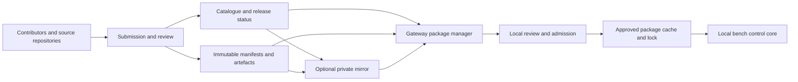

# STG central device registry — Architecture contract 1.0.0

**Companion baseline:** STG 1.5 · OTDP 0.1.0 · adapter API 0.1.0  
**Status:** Selected architecture; no registry service, publishing pipeline or package manager is implemented.

## 1. Purpose and selected design

Provide one searchable community catalogue where users can discover, evaluate and reuse device profiles, model descriptors and plugin implementations. Contributions retain source history and attribution. An organisation can operate a private registry or an approved mirror using the same contracts. A gateway uses a locally approved, pinned package set and does not depend on registry availability during a test.

| Option | Trade-off | Decision |
|---|---|---|
| Git repository alone | Simple contributions, but weak structured compatibility discovery and release admission | Use for source collaboration, not as the sole distribution contract |
| Searchable registry, immutable artefacts and linked source repositories | Explicit metadata, reuse, reproducible releases and private mirrors | Selected |
| Central service executing bench operations | Adds network dependence and conflates package management with physical authority | Outside scope |

The first deployment may generate its catalogue and signed release metadata from a curated Git repository and serve static artefacts. A database or custom web application is not an architectural prerequisite. The logical boundary supports search, contribution review and immutable downloads regardless of storage product. Hosting provider, domain and implementation technology are deployment choices.

## 2. Components and authority

The registry manages distribution, ownership and evidence. It cannot authorise a fixture, widen a DUT limit, send device commands or activate downloaded code. Search and inspection never import a plugin or execute build/install hooks. Download, admission and activation are distinct operations. Activation uses the existing safe, idle configuration boundary and creates a new configuration generation. An active procedure pins its package lock for its entire lifetime.

## 3. Shareable units and identity

A release has kind `profile`, `descriptor` or `implementation`:

- **Profile:** reusable class/action definitions, schemas, semantics and conformance vectors. No executable payload or model-specific descriptor is permitted under this kind.
- **Descriptor:** one or more model definitions and exact profile dependencies. Declarative integrations can be shared without executable code. Adapter descriptors declare an exact implementation dependency.
- **Implementation:** executable adapter and its supported descriptors, tests, source reference and dependency inventory. It declares any profile/descriptor packages it consumes. To avoid dependency cycles, an implementation containing its own descriptors must not depend on a descriptor package that points back to it.

A package is identified by `(registry_id, package_id)`; a release adds an exact version and manifest SHA-256. Registry identity is bound to an administratively configured origin and trusted signing root. `package_id` has publisher namespace/name form. Descriptor IDs, profile IDs, Python import names and physical instrument serial numbers are separate identities. A fork gets a new package ID and records its upstream release. A mirror preserves original identities and digests; repackaging creates a new release.

Namespaces are reserved to verified publisher accounts. Only the project standards maintainers may publish official `otdp` profile identities. Community extensions use their own namespace. Names are never silently reassigned after deletion or publisher inactivity. Transfers require current-owner and registry-admin approval with audit history; past release attribution is retained.

## 4. Required release metadata

`release-manifest.schema.json` defines the immutable record. Required fields are:

| Group | Required information and use |
|---|---|
| Identity | Registry ID, package ID, exact version, kind, display name, summary, release time and searchable tags |
| Accountability | Publisher ID, named maintainer contacts, support and issue links |
| Reuse rights | SPDX licence expression, bundled licence file, source URL and immutable source revision |
| Compatibility | Exact supported OTDP, adapter API and STG versions; target OS/architecture/Python versions and required host-provider IDs |
| Device matching | For device-bearing packages: manufacturer, exact model, documented aliases, firmware policy, transport and provided profile/descriptor IDs |
| Dependency closure | Exact registry/package/version/manifest digest for every required registry dependency |
| Payload integrity | Archive digest and size, and every unpacked file's path, role, size and SHA-256 |
| Permissions | Complete host-service permission requirements, explicitly empty where none |
| Evidence | Test-report files with level, test date, exact tested model/firmware or synthetic target, result and limitations |
| Maintenance | Changelog and migration notes, known limitations, optional upstream lineage |
| Executable packages | SBOM, build provenance, exact dependency lock and supported runtime matrix |

Compatibility versions are explicit tested/supported values, not an invented range language. An empty adapter list means no adapter; an empty runtime matrix is allowed only for non-executable packages. Firmware mode is either an exact nonempty list or `commissioning_required` with no implied tested firmware. Search may suggest aliases, but only commissioned device identity and the descriptor can establish a match. A manufacturer/model substring is never permission to install or control.

A profile-only package has no device targets. A descriptor or implementation must list targets. A combined device can provide multiple profiles. Device-specific command maps, default connection keys and documentation may be shared; endpoint credentials, serial selection, bench topology, safety limits, personal data and private test captures are excluded. Authors sanitise reports before submission. Rights to redistribute manuals, firmware, SDKs and dependencies must be established; a documentation reference does not grant redistribution rights.

The release manifest is outside its payload archive, avoiding a circular self-hash. The file list covers the entire normalised unpacked payload. No extra files, absolute paths, `..`, duplicate paths, symlinks, hardlinks or case-fold collisions are admitted. Consumers impose configured archive/file-count/unpacked-size limits before extraction. File hashes do not replace authenticated release metadata.

Every payload file carries exactly one role: `profile`, `descriptor`, `implementation`, `schema`, `test`, `documentation`, `licence`, `sbom`, `build_provenance`, `dependency_lock` or `skill`. `skill` is an agent-facing skill document in the cross-harness skills format (frontmatter `name` + `description`; the `SKILL.md` convention). BenchWeave names the format, not the consuming harness — no client or vendor is assumed. The distinction from `documentation` is consumption: documentation is human-facing prose, a skill is machine-discoverable agent guidance, and CLAUDE.md-class project instruction files are `documentation`, not `skill`. A release may carry multiple skill entries. The file is listed with path, size and SHA-256 exactly as every other role; its `name`, `description` and trigger remain in the document's own frontmatter, not in the manifest.

## 5. Mutable management records

`release-status.schema.json` defines separately versioned, authenticated status. It identifies the immutable release digest and contains lifecycle state, owner-assigned support status, review decisions, advisories, timestamps, a monotonically increasing sequence and an expiry. Releases are immutable; reviews and advisories can evolve without rewriting them.

Lifecycle: `published` → `deprecated` or `yanked` or `revoked`. Deprecation permits installation under local policy and identifies a replacement when available. Yanking removes a release from normal selection but preserves history; an explicit digest-pinned exception requires recorded local approval. Revocation blocks new admission and new procedure starts once known, including any dependent package closure. A correction to revocation requires a new authenticated status and explicit local re-admission; it never automatically restores use. Legal removal may remove payload bytes, but the identity, digest and tombstone remain; a tombstone is not a reinstall guarantee.

Review status is scoped to reviewer identity, report digest and release digest: `unreviewed`, `changes_requested` or `accepted`. It is independent of evidence level: `structural`, `simulated` or `hardware`. Community, publisher and vendor provenance is displayed explicitly. Download counts and popularity are not quality or safety evidence. A hardware report applies only to its listed firmware, model, transport/backend and test environment; it does not qualify every bench or unattended use.

Support state is `maintained`, `maintenance_only` or `unmaintained`, with a support contact. Registry operators publish namespace ownership and status history, moderate misleading claims, handle security reports and preserve audit records. A package may remain discoverable when unmaintained, with that state visible.

## 6. Discovery and reuse workflow

A user or coding agent searches by manufacturer/model, alias, device class, transport, OTDP/API version, host platform, licence, review/evidence level and maintenance state. Results show matching reasons, explicit incompatibilities and unknowns. No compatible result means report the gap; do not select a similarly named package automatically.

Before authoring a new integration, inspect existing candidates and reuse an exact compatible release, contribute an upstream fix, or fork with recorded lineage. Do not rewrite a plugin merely because its author or source host differs. Inspect its documentation, licence, permissions, tests and known limitations before proposing adoption. A package that needs broader permissions or a new backend must surface that difference for local review.

The initial service contract provides these logical operations:

| Operation | Required behaviour |
|---|---|
| Search | Filters above; bounded pagination, stable snapshot token, package/release identity and match explanation |
| Read package | Owner, available versions, source/support links and maintenance history |
| Read release | Exact immutable manifest bytes and digest; authenticated distribution metadata |
| Read status | Current sequence/expiry, reviews, lifecycle and advisories for the exact release |
| Fetch artefact | By verified digest and size; content must match the authenticated release |
| Submit | Authenticated publisher, candidate manifest/payload/evidence and idempotent submission ID |
| Review/publish | Authorised review decision; atomic publication of complete validated dependency closure |
| Change status | Authorised reason/evidence, monotonic sequence and audit event; no payload mutation |
| Export/import | Full pinned dependency closure and authenticated metadata for mirroring/offline admission |

Search indexes may be eventually consistent. Admission must recheck authenticated release/status metadata. Missing/deleted packages return an explicit unavailable/tombstone result; broken dependency closure fails admission. Authentication, rate limits and quotas apply to publishing and private reads. Public anonymous reads may be enabled. HTTP routes and pagination encoding are implementation-level choices; these semantics are mandatory.

## 7. Publication and supply-chain boundary

A submission passes namespace ownership, licence/secret checks, schema validation, profile/action semantics, dependency closure, archive hygiene and applicable tests. Executable packages also provide a dependency lock, SBOM and build provenance. New executable releases need an identified reviewer distinct from the submitting identity. Tests run in an isolated build environment without production bench access or publisher secrets. A passing submission does not execute on a user's gateway.

Use The Update Framework (TUF) for authenticated distribution, with trusted-root bootstrap out of band, delegated publisher namespaces, snapshot consistency, expiry/rollback checks and documented key rotation/recovery. Manifests and status records are authenticated targets; downloaded artefact digests are bound through the manifest. A signature proves the authorised distribution identity, not correctness of device behaviour. TUF addresses update threats including rollback, freeze and inconsistent metadata; hashes or TLS alone are not the selected update contract. [TUF security model](https://theupdateframework.io/docs/security/)

The registry publishes only after all referenced release content is durable and retrievable. Failed publication leaves a non-discoverable submission and can retry with the same ID. Registry admins control signing infrastructure; maintainers control their namespaces; local bench owners control admission. Compromise handling includes key revocation, affected-release identification and notification. The exact TUF version, signer thresholds and recovery custody must be recorded in the registry deployment profile before service qualification; this document does not define new cryptography.

## 8. Local resolution, offline operation and updates

Resolution uses configured registry identities and namespace routing. Never fall back from a private package name to a public registry, or use global “highest version wins”. All transitive registry dependencies and executable language/runtime dependencies must be pinned and available before activation. Dependency cycles, conflicting profile definitions or incompatible host requirements are rejected. The resolver does not fetch requirements opportunistically while a test is running.

`package-lock.schema.json` records the selected full closure with origin IDs, versions and manifest digests, the local approval identity/time and policy version. Registry dependency closure must exactly match the lock; there are no floating dependencies. The lock digest is attached to procedure and configuration evidence. The separate local admission record binds that lock to device/fixture identity and commissioning evidence; neither record is uploaded by default.

Workflow: discover → inspect → resolve/pin → verify/download → local review → qualify as needed → activate at an idle safe boundary. No auto-update, post-install hardware probe, energisation or self-modification occurs. Permission, API, profile semantics or model-limit changes are explicit review differences. Rollback selects an earlier non-revoked approved lock at a safe boundary and rechecks configuration compatibility; it does not imply that device physical state rolls back.

An outage or expired distribution metadata blocks new admission, not immediate continuation of an already approved active procedure. Offline starts use a commissioned maximum status age, cached valid approval and bounded procedure policy; unknown freshness never becomes silently fresh. A newly learned revocation blocks subsequent starts; active work follows its pre-approved local protective response, without unloading a live plugin midway through an operation. Offline gateways cannot learn new revocations until synchronisation; this residual limitation must be included in offline qualification.

Private mirrors preserve origin signatures/digests and may add organisational approvals. Export bundles include the full closure, manifests and TUF metadata, but no secrets or trust roots that automatically become trusted. The receiving administrator already trusts or explicitly establishes the origin. Expired metadata cannot be bypassed by labelling an import offline; a separately recorded local exception requires accountable approval and does not count as a successful online metadata validation.

## 9. Operations and acceptance obligations

The registry operator owns backups, restore verification, signing-key recovery, audit retention, package retention, abuse handling and availability targets. Source history alone is not a backup of published artefacts. Content-addressed storage may deduplicate blobs, but garbage collection retains every release referenced by supported releases, approved retention policy or legal obligations. Restore must preserve identities, digests and monotonic metadata history. Quotas and maximum artefact sizes are deployment inputs, not unrestricted defaults.

Before claiming implementation conformance, demonstrate: independent users discover/reuse one release; two profiles can share one implementation without identity collision; private/public name collision cannot redirect resolution; tampered/expired/rolled-back metadata is rejected; permission changes require re-admission; dependency conflicts and cycles fail; unreviewed and simulated evidence are labelled; firmware mismatch blocks admission; yanked/revoked releases behave as specified; offline approved tests obey freshness policy; updates wait for the safe boundary; and backup restore retains published release identity and history.

The accompanying schema checks verify metadata structure and selected cross-field rejection cases only. They do not prove publishing, signature verification, package execution, hardware qualification or registry availability.

## 10. Metadata semantic validation

After schema validation, admission verifies that the publisher owns the namespace; all referenced files exist in the payload inventory with the correct role; provided IDs match actual profile/descriptor contents; every consumed profile and adapter resolves in the pinned dependency closure; and the manifest's permissions/compatibility agree with those contents. No metadata field can override the narrower device or host contract.

Paths are unique after normalisation and case folding. Licence expressions must parse against the configured SPDX licence-expression rules; a nonempty string alone does not suffice. Source revisions must identify immutable source content, not a mutable branch or tag. Evidence reports include exact backend/runtime, methods, test outcomes and scope. Profile packages include definitions and conformance vectors; device packages include each advertised descriptor. Build provenance identifies inputs, toolchain and output digest. Dependency locks cover all executable transitive dependencies and artefact hashes; SBOMs do not replace locks.

Each registry/package occurs once in a dependency closure. Lock roots must be present in packages; no missing or extraneous package is accepted relative to the resolved closure. Duplicate identities, cycles, digest disagreements and conflicting provided IDs are errors. Registry routing is resolved before dependency selection.

Status expiry must follow its update time; future times outside configured clock tolerance are rejected. Clients persist the highest authenticated sequence per release and reject older status. Reviews, replacements and advisories bind to the exact immutable release. An accepted executable review must come from an authorised identity distinct from the submitter. An accepted review with only simulated evidence remains visibly simulated.

## 11. Composition closure in STG 1.5

The registry composition review records profile ownership versus consumption, one-way wrapper-descriptor dependencies, exact compatibility intersection, single-version closure and physical-instance ownership. `provides.profile_ids` identifies definitions; `device_targets.profile_ids` identifies consumed/implemented profiles. A package consuming an official profile does not own or redefine its ID. Bundled copies must match the admitted definition digest. A separately published wrapper descriptor depends on its implementation without a reverse dependency, has a distinct descriptor ID and cannot widen the implementation's verified compatibility. Two descriptors resolving to one physical instrument still use one instance and ownership domain. The three package kinds and their schemas remain unchanged.
